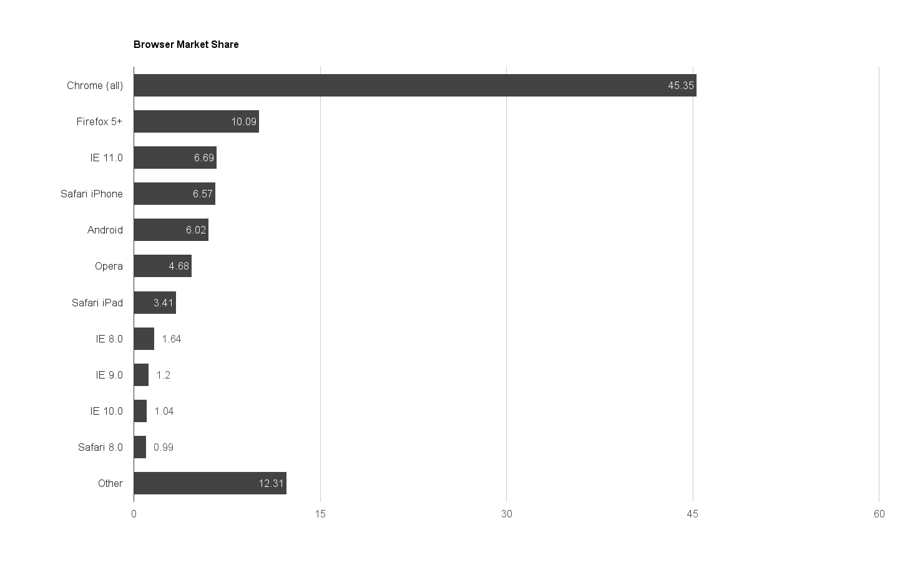

# Introduction

In 1998 Tim Berners-Lee, the creator of the web, published [The World Wide Web: A very short personal history](https://www.w3.org/People/Berners-Lee/ShortHistory.html). In this brief essay he states:

> The dream behind the Web is of a common information space in which we communicate by sharing information. Its universality is essential: the fact that a hypertext link can point to anything, be it personal, local or global, be it draft or highly polished.

To Berners-Lee the universality of the web is exactly that which allowed the web to grow from a single server at his desk to a global communication network with over 3 billions users worldwide[^1]. While built upon the technologies established in those early days of the web, today's web has grown beyond the concept of hyperlinked documents. Today we build rich graphical interfaces that encompass anything from a text document to a real-time video application while also providing for many their primary means for personal interaction, information, and fundamental social services.

With the rise of information and immersive applications on the web, we have created a global network that is heavily relied upon by society. Pausing to think about this, it is a beautiful thing and, true to Berners-Lee’s vision, there remains little barrier to entry to publishing a site or application. However, as web developers it is a professional and social responsibility to ensure that our sites and applications work for as many people as possible. 

I have often been tempted to regard browser or device testing casually in favor of using the latest and greatest tools and browser features. Learning to use these new tools is one of the things that make web development so enjoyable, but we must temper this desire with the ability to build sites that work for as many users as possible. We should avoid shutting out users or denying them our services due to technical constraints. When we do this, we are taking an elite position, potentially shutting out the poor, disabled, and elderly. Imagine a storefront who didn’t allow customers to enter if their shoes and clothes were too old. As a society we would find that offensive and the shopkeeper would likely be publicly disgraced on the evening news. However, we often put banners on our site that say, “This site only supports X browser or newer,” when a visitor accesses it with an older browser. Or worse, the site will silently fail, akin the shopkeeper refusing to open the till and take payment.

## It Just Works

My wife and I began dating in 2003 and within a year or so I became her family’s default “computer expert.” In 2005 I helped my father in-law, Marty, pick out a new computer for himself. To him this was akin to an appliance purchase and we picked out a sturdy desktop computer, which has been in continuous use since then. We’ve made some upgrades to the RAM and I’ve done my best to point him to using an evergreen browser that automatically updates, but those no longer update on his aged XP system. When I asked him why he doesn’t upgrade, he just shrugs and says “it still works.” For him, the existence of the web browser is enough. He assumes that by typing in a URL, that the browser and machine connecting shouldn’t make a difference.

When my grandfather passed away my grandmother, Kathy, wanted to learn to use a computer and connect the web. Her primary device is an inexpensive and outdated Android tablet that connects to the web through a wireless connection from the rural area where she lives. She uses it to check Facebook, read the news, read books, and play solitaire.  

As developer we want to assume that people like Marty and Kathy are edge cases. Looking at the top browsers currently in use, when grouped together, device specific browsers, outdated “evergreen” browser versions, and uncommon open source browsers occupy the second largest percentage of market share[^2]. Though each of these browsers and versions may only show up in our analytics as a fraction of a percent, when grouped together they become a powerful representation of the market.

Though the users of these browsers may not be the target demographic for our applications and services, by not making accommodations for them we are denying them the opportunity to participate.

[^2]: The site StatCounter provides these metrics http://gs.statcounter.com/#all-browser_version_partially_combined-ww-yearly-2015-2016-bar. I’ve made the full list available as a css at https://gist.github.com/ascott1/1f9b8fdc7529e4dd7823.

## A Responsibility

As web developers, we are gatekeepers to the vast troves of information and interaction across the web. With this comes a responsibility to ensure that the web is an open and inclusive space for all. The following chapters attempt to lay a groundwork for inclusive web development through:

- **Progressive enhancement.** By building progressively we can ensure that all users have access to a base experience, regardless of technology or network conditions.
- **Accessibility.** By building accessible user interfaces we ensure that everyone has equal access to our applications regardless of disability or age.
- **Inclusive forms.** Forms allow users to interact directly with the web, making it a two way form of communication. By creating web forms that are inclusive and usable, we demonstrate our dedication to inclusion.
 

[^1]: http://www.internetlivestats.com/internet-users/
