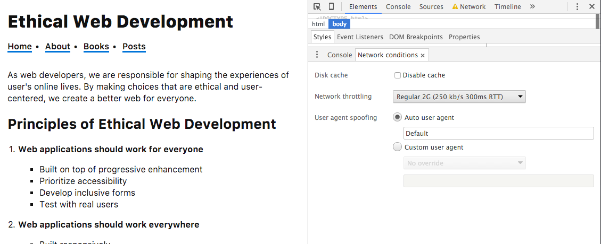

# Progressive Enhancement

Progressive enhancement is a term that often insights intense debate. For many, progressive enhancement can be summed up as “make your site work without JavaScript.” While, developing a site that works without JavaScript often does fall under the web of progressive enhancement, it can define a much more nuanced experience.

In Aaron Gustafson’s seminal A List Apart Article, [Understanding Progressive Enhancement](http://alistapart.com/article/understandingprogressiveenhancement), he describes progressive enhancement as a peanut M&M. The peanut being the core experience, which is essential to the user. The chocolate encompasses the features and design that take us beyond the naked peanut experience and add some much loved flavor. Finally, the candy shell, though not necessarily needed, provides added features, such as not melting in your hand. Oftentimes this example is translated to HTML as the peanut, CSS as the chocolate and JavaScript as the candy shell.

In today’s web application landscape it may be over simplified to consider progressive enhancement as simply “works without JavaScript.” In fact, many of the rich interactions and immersive experiences that have come to define the modern web certainly require JavaScript. For progressive enhancement to be considered an ethical issue in web development, we must tie it back to user needs. Progressive enhancement is about defining what a user *needs* and ensuring that it is always delivered to them, in a way that will work regardless of network conditions, device, or browser.

I prefer [Jeremy Keith’s take](https://youtu.be/-yIbKaA3wCo) that progressive enhancement is a “process” rather than a specific technique or set of technologies. By Keith’s definition this process looks like:

1. Identify the core functionality
2. Make that functionality available using the simplest technology
3. Enhance!

As a developer it is our job to determine the “core functionality” of our application and what is an enhancement. This allows us to develop a baseline to build from, yet the baseline for any given project may be different.

In his 2012 article, [Stumbling on the Escalator](https://www.christianheilmann.com/2012/02/16/stumbling-on-the-escalator/), Christian Heilmann appropriated a Mitch Helberg comedy bit about escalators for progressive enhancement:

> An escalator can never break – it can only become stairs. You would never see an “Escalator Temporarily Out Of Order” sign, just “Escalator Temporarily Stairs. Sorry for the convenience. We apologize for the fact that you can still get up there.”

As a person who has spent a lot of time in the Washington DC metro system, I can really appreciate this analogy. Fortunately, when an escalator is out I am not trapped underground, but instead can huff up the now stairs to the street.

Oftentimes, when beginning a project, I am presented with a set of business requirements or a beautiful design. From these, it can be easy to see the end goal, but skip the baseline experience. If, in the case of the escalator, my requirement was to “build a transportation system that will allow Metro riders to travel from the terminal to the street,” my initial reaction may be to create an elevator. You can imagine how this might become problematic.

Developing web apps works in much the same way. If we only consider the end goal, we run the risk of leaving our users stranded. By focusing on and providing a solid baseline for our users, we set ourselves up for success in many other aspects of ethical web development, such as accessibility and performance.

## Defining core functionality

If progressive enhancement is the process of defining a core functionality and building up from there, how do we define that initial baseline? The goal is to consider the bare minimum that a user requires to use our application. Once we have defined this, we can layer on additional style and functionality. For some applications this may be a completely JavaScript free version of the experience, while for others it may be a less fully featured version, and still others it may be providing some server rendered content on the initial page load only.

The key is to think of progressive enhancement not as a binary option, but instead as a range, determining what is the best decision for users. In this way, progressive enhancement is a gradient rather than an either/or option. Our responsibility is to decide where on this gradient our particular application falls.


I’d encourage you to take a few minutes and consider what the core functionality might look like for a few different types of websites and applications. Identify the primary goal of the site and determine the minimum amount of technology needed to implement it. To take it a step further, write some markup or pseudo code explaining how you might implement those baseline and features.

- News website
- Social network (write text posts and read the feed of friends)
- Image sharing website
- Web chat application
- Video chat application

When working on your own applications, try to perform the same exercise First, determine the core functionality for your users and build the application from there. This programatic approach also pairs well with the [Agile](http://www.agilemanifesto.org/) approach to software development, where the goal is to deliver working software at the end of each development sprint. If we first deliver a core experience, we can iteratively build upon that experience while continuing to deliver value.

## Is progressive enhancement still relevant?

Some may question how relative progressive enhancement is today, when a small percentage of users browse the web with JavaScript disabled[^1]. This places the focus too heavily on progressive enhancement as a JavaScript free version of a site. In fact, some types of applications, such as video chat, absolutely require some form of JavaScript to work in the browser. The goal of progressive enhancement is to provide the absolute minimum for a working product and ensure that it is delivered to user's browser.

Ideally, this working minimum product is simply HTML without any external resources such as images, video CSS, or JavaScript. When a user's browser requests our site we can be certain that they will receive HTML (or nothing at all). By creating a working version of our application, even with a minimal experience, using the smallest number of assets, we can be sure that the user is able to access our content in some form.

The Digital Services team at Gov.uk [provides a number of scenarios](https://www.gov.uk/service-manual/making-software/progressive-enhancement.html#it-isnt-about-javascript-off) where asset requests may fail:

> - temporary network errors
> - DNS lookup failures
> - server that the resource is found on could be overloaded or down, and fail to respond in time or at all
> - large institutions (eg banks and financial institutions, some government departments) having corporate firewalls that block, remove or alter content from the Internet
> - mobile network providers resampling images and altering content so that load times faster and reduce bandwidth consumed
> - antivirus and personal firewall software that will alter and/or block content

Additionally, in the blog post [How many people are missing out on JavaScript enhancement?](https://gds.blog.gov.uk/2013/10/21/how-many-people-are-missing-out-on-javascript-enhancement/), they add:

> - existing JavaScript errors in the browser (ie from browser add-ons, toolbars etc)
> - page being left between requesting the base image and the script/noscript image
> - browsers that pre-load pages they incorrectly predict you will visit

While those of us developing for the web often have nice hardware and speedy web connections, that may not be true for many of our potential users. Those in developing or rural areas may have limited or outdated devices and slow connections. In 2015 the Facebook development team began participating in [2G Tuesdays](http://www.businessinsider.com/facebook-2g-tuesdays-to-slow-employee-internet-speeds-down-2015-10), which allows them to experience their applications as though they are being served over these slower networks. I would encourage you to do the same.

Today's browser development tools [allow us to mimic network conditions](https://developers.google.com/web/tools/chrome-devtools/profile/network-performance/network-conditions), experiencing what it is like for these users to access our sites. We will explore these topics in detail when considering web performance.



Though you may have never used, tested an application with, or even heard of it, the [Opera Mini](http://www.opera.com/mobile) browser currently has over 300 million users worldwide[^2]. The browser is designed to greatly decrease mobile bandwidth usage by routing pages through Opera's servers and optimizing them. To do this, Opera Mini only supports a subset of modern web standards. Here are a few of the things that are unsupported by Opera Mini:

- Web fonts (which also means no icon fonts)
- HTML5 structural elements and form features
- Text decoration styling
- Video and audio elements

The site [WTF Opera Mini](http://wtfoperamini.com/) collects the full set of modern web standards that are not supported in the browser. As you can imagine, without a progressive enhancement strategy, our sites may be completely inaccessible for all 300 million+ Opera Mini users.

If developing an application that is exclusively for users who are likely in an urban area with strong Internet speeds and nice hardware, it may feel as if we are exempt from concerning ourselves with connection issues. Recently, developer [Jake Archibald](https://jakearchibald.com/) coined the termed "Lie-Fi." This is a connection where our mobile device seems to be connected to wifi, but sites are slow to load as they feebly connect to our struggling signal.


In addition to the conditions described above, there may be external factors at play. In 2014 the UK's Sky broadband accidentally briefly [blocked the jQuery CDN](http://www.thinkbroadband.com/news/6261-sky-parental-controls-break-jquery-website.html), presumably leaving many users perplexed with broken websites.

### Run your own experiment

The gov.uk's digital services team was curious to see how many users were missing out on JavaScript resources when accessing their site. To test this, they [ran an experiment](https://gds.blog.gov.uk/2013/10/21/how-many-people-are-missing-out-on-javascript-enhancement/) by adding three images to a page:

- An image that all browsers should request
- An image that would only be requested via JavaScript
- An image that only browsers with JavaScript disabled would request

The results of this experiment are really fascinating. Though only a fraction of a percentage of users requested the JavaScript disabled image, those that failed to load the image requested via JavaScript were significantly higher.

If possible, I'd encourage you and your teams to conduct a similar experiment. This allows us to base the decision to support (or not support) Javascript-disabled users on real world data, rather than assumptions or world averages.

[^1]: In 2010 Yahoo conducted what is considered the [definitive study of JavaScript usage](https://developer.yahoo.com/blogs/ydn/many-users-javascript-disabled-14121.html) finding that the percentage of users with JavaScript disabled ranged from 0.26% to 2.06%, depending on the country of origin. Sadly, these statistics are woefully out of date. In 2013 the UK's Digital Services team did a [similar study](https://gds.blog.gov.uk/2013/10/21/how-many-people-are-missing-out-on-javascript-enhancement/) and found that 1.1% of their users were not receiving JavaScript. The German site [darwe.de](http://darwe.de) analyzes JavaScript enablement in real time and shows a [much larger percentage](http://www.darw.de/statistik/statistik-js.php) of users with JavaScript disabled visiting their site.

[^2]: [The unknown browser with 300 million users that’s breaking your site](http://thenextweb.com/dd/2015/12/24/the-unknown-browser-with-300-million-users-thats-breaking-your-site/)

## How can we approach progressive enhancement today?

Recently, I was talking with my friend and colleague [Scott Cranfill](http://www.scottcranfill.com) about a progressive enhancement strategy for a project he was working on. This project was mostly static content, but also included an auto loan calculator. When discussing how he might approach this from a progressive enhancement angle, he mentioned that he thought he default markup should simple include the formula that the calculator uses. Once the page's assets load, a fully functional dynamic calculator will display. This means that nearly every user will only see and interact with the calculator, but should something go wrong, a user will still be presented with something that is potentially useful. I loved this pragmatic approach. It wasn't about "making it work without JavaScript," but instead about making it work for everyone.

In the world of modern JavaScript driven web applications, there are still several practical approaches we can take to build progressively enhanced sites. These approaches can be simple or leverage exciting web technology buzz words such as Isomorphic JavaScript or Progressive web applications. Since progressive enhancement is not a one sized fits all approach, you may want to evaluate this options and choose the one that best works for your project.

Let's take a look at a few of these options and how they may be used to build the best possible experience for a user.

Perhaps the simplest and most progressive is to completely avoid a JavaScript dependent first page render. By rendering all of the **necessary** content on the server, we can ensure that a user receives a useable page, even if only our HTML makes it to their browser. The key here is to focus on what is necessary. There may be additional JavaScript required functionality, but if it isn't necessary we can allow it to quietly fail in the background or present the user with different content.

With this (or any approach), if you choose to serve a library from a CDN, I would recommend following the [HTML5 Boilerplate's](https://html5boilerplate.com/) lead to provide a local fallback as well. This allows us to leverage the benefits of the CDN while ensuring that the user has the opportunity to downloads the scripts should there be an issue with the CDN, such as unexpected down time or being blocked by an ISP or third party browser add-on.

```html
<script src="https://code.jquery.com/jquery-1.12.0.min.js"></script>
<script>window.jQuery || document.write('<script src="js/vendor/jquery.min.js"><\/script>')</script>
```

Another option, or one that may paired with the previous, is to sniff out outdated browsers and avoid serving JavaScript to those browsers. We can continue to serve our core content and functionality to those browsers (it was progressively enhanced after all!), but offer a significantly simpler experience.

To sniff out older browsers, we can use a technique demonstrated by Jake Archibald from [his talk](https://youtu.be/EVEiIlJSx_Y) at Nordic.js in 2015:

```javascript
(function() {
  if (!('visibilityState' in document)) {
    return false;
  }

  // rest of your code
}());
```

For JavaScript dependent applications we could render the landing page as HTML on the server while prefetching the JavaScript for the rest of the application.

```
<link rel="prefetch" href=“app.js”>
```

This approach gives our user's the opportunity to download and cache the application's JavaScript, without impacting the performance or requirement on a mostly static page. Soon browsers will begin implementing the [Preload specification](https://w3c.github.io/preload/), which will be similar to Prefetch, but enable additional browser features.

In action preload looks similar to prefetch:

```
<link rel="preload" href=“app.js" as="script">
```

### Prefetch and Preload resources

- [Prefetching, preloading, prebrowsing](https://css-tricks.com/prefetching-preloading-prebrowsing/)
- [HTML5 Prefetch](https://medium.com/@luisvieira_gmr/html5-prefetch-1e54f6dda15d)
- [Preload: What Is It Good For?](https://www.smashingmagazine.com/2016/02/preload-what-is-it-good-for/)

You may be thinking, "but I want to build *modern* JavaScript web applications and these are old techniques." Certainly these techniques feel out of sync with the approaches of some of the popular JavaScript frameworks, but recently we've seen the most popular web application approaches trend back towards a progressive enhancement model.

Isomorphic or Universal JavaScript is a technique that allows a developer to pair server and client side JavaScript into a "write once, run everywhere approach." This technique means that the initial application will render on the server, using Node.js and then run in the browser. When building a progressively enhanced Isomorphic app we can start by building our server rendered version of the applications and layer on the Isomorphic approach.

A similar approach was taken by the team behind the recent [Google+ redesign](https://developers.google.com/web/showcase/case-study/googleplus):

> With server-side rendering we make sure that the user can begin reading as soon as the HTML is loaded, and no JavaScript needs to run in order to update the contents of the page. Once the page is loaded and the user clicks on a link, we do not want to perform a full round-trip to render everything again. This is where client-side rendering becomes important — we just need to fetch the data and the templates, and render the new page on the client. This involves lots of tradeoffs; so we used a framework that makes server-side and client-side rendering easy without the downside of having to implement everything twice — on the server and on the client.

<ASIDE>
Though my description may be over simplified, Isomorphic JavaScript is an exciting approach for developers and teams who are using server side JavaScript. To learn more about Isomorphic JavaScript, I recommend taking a look at

- [Building Isomorphic JavaScript Apps](http://shop.oreilly.com/product/0636920042846.do) by Jason Strimpel
- [Isomorphic JavaScript: The Future of Web Apps](http://nerds.airbnb.com/isomorphic-javascript-future-web-apps/)
- [Universal React](https://24ways.org/2015/universal-react/)
</ASIDE>

If a fully Isomorphic JavaScript approach is overkill for an application, Henrik Joreteg has coined the term ["Lazymorphic" applications](https://blog.andyet.com/2015/05/18/lazymorphic-apps-bringing-back-static-web/). A Lazymorphic app is simply one where the developer pre-renders as much of the application as possible as static files at build-time. Using this approach we can choose what we render, making something useful for the user while withholding JavaScript dependent features.

Lastly, the term [Progressive Web Apps](https://developers.google.com/web/progressive-web-apps) has recently taken hold. Rather than specific technology, this term has come to encompass several interrelated techniques and approaches to web development. This is an approach that pairs nicely with all of those listed above.


In his article [Progressive Web Apps: Escaping Tabs Without Losing Our Soul](https://infrequently.org/2015/06/progressive-apps-escaping-tabs-without-losing-our-soul/), Alex Russell described progressive web applications in this way:

> Responsive: to fit any form factor
> Connectivity independent: Progressively-enhanced with Service Workers to let them work offline
> App-like-interactions: Adopt a Shell + Content application model to create appy navigations & interactions
> Fresh: Transparently always up-to-date thanks to the Service Worker update process
> Safe: Served via TLS (a Service Worker requirement) to prevent snooping
> Discoverable: Are identifiable as “applications” thanks to W3C Manifests and > Service Worker registration scope allowing search engines to find them
> Re-engageable: Can access the re-engagement UIs of the OS; e.g. Push Notifications
> Installable: to the home screen through browser-provided prompts, allowing users to “keep” apps they find most useful without the hassle of an app store
> Linkable: meaning they’re zero-friction, zero-install, and easy to share. The social power of URLs matters.

The Progressive Web Application approach described above is well aligned to an ethical web application experience by focusing on delivering an application experience that works for every user.

<ASIDE>
Progressive Web App resources

Though rooted in several technologies, the overarching concept of progressive web apps is just starting to take hold. Here are a few of the resources that I've found most useful for getting started.

- [Google Developers: Progressive Web Apps](https://developers.google.com/web/progressive-web-apps)
- [Progressive Web Apps: Escaping Tabs Without Losing Our Soul](https://infrequently.org/2015/06/progressive-apps-escaping-tabs-without-losing-our-soul/)
- [Getting started with Progressive Web Apps](https://addyosmani.com/blog/getting-started-with-progressive-web-apps/)
</ASIDE>


## In Summary

There are a variety of techniques and approaches that allows us to build progressively enhanced modern web sites and applications. I've outlined a few of them above. By beginning with the core functionality, we are able to ensure that our application works for the maximum number of people. This provides us with a baseline to provide working software for all users in a range of situations.

### Benefits of progressive enhancement

From an ethical standpoint, progressive enhancement provides several benefits to our users. By following a progressive enhancement process, we can be sure that we are building our applications in a way that allows them to be available for as many users as possible, regardless of device, connection, or browser.

### Quick tips

To make the most of the progressive enhancement approach, be sure to:

- Focus on user needs.
- Define the core functionality and build from there.
- Remember that sites doesn’t have to look the same on every device and browser.
- Avoid the assumption that all assets will be available.

### Additional resources

- [Understanding Progressive Enhancement](http://alistapart.com/article/understandingprogressiveenhancement)
- [Progressive enhancement: How to create pages that work regardless of browser capability](https://www.gov.uk/service-manual/making-software/progressive-enhancement.html)
- [Cutting the Mustard](http://responsivenews.co.uk/post/18948466399/cutting-the-mustard)
- [Progressive enhancement is still important](https://jakearchibald.com/2013/progressive-enhancement-still-important/)
- [Stop Breaking the Web](https://ponyfoo.com/articles/stop-breaking-the-web)
