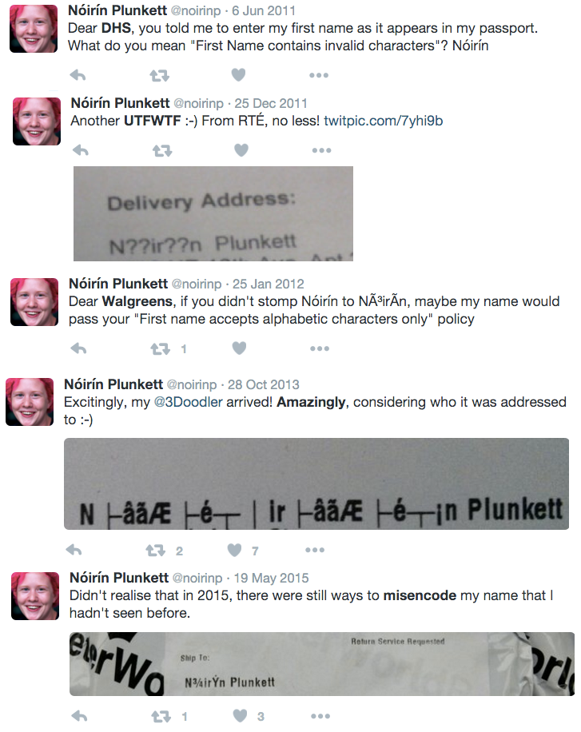
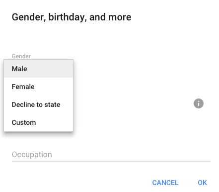
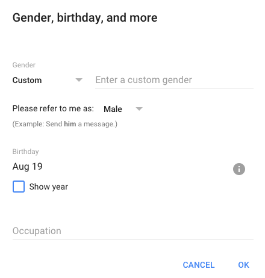
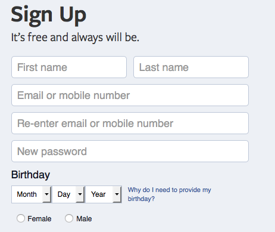
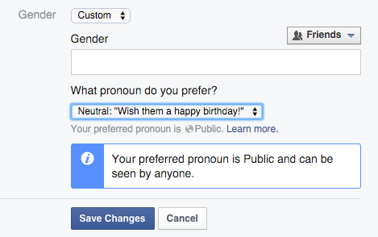

# Developing inclusive forms

We forms allow users to interact directly with a site. They are often the thing that separates a web site from a web application.s

## What’s in a name?

In Dale Carnegie’s influential 1936 self-help book, *How To Win Friends and Influence People*, he states “a person's name is, to that person, the sweetest and most important sound in any language.” Names are a core part of our personal identities. We often identify with them, turn at the sound of them said across the room, and intuitively appreciate when a person we have just met understands our names.

Unfortunately, as web developers, it is possible make assumptions about names that lead to their incorrect handling. When working with names, we should be prepared for a variety of characters, spacing, and unique international formats.

In his article [Falsehoods Programmers Believe About Names](Falsehoods Programmers Believe About Names), Patrick McKenzie lists out 40 common misconceptions. Among them, the assumptions that:

> - People have exactly one canonical full name.
> - People’s names fit within a certain defined amount of space.
> - People’s names are written in any single character set.
> - People have last names, family names, or anything else which is shared by folks recognized as their relatives.
> - My system will never have to deal with names from China, Japan, Korea, Ireland, the United Kingdom, the United States, Spain, Mexico, Brazil, Peru, Russia, Sweden, Botswana, South Africa, Trinidad, Haiti, France, or the Klingon Empire, all of which have “weird” naming schemes in common use.

The full list is well worth a read, as it succinctly points out many potential missteps.

In her article, [Hello, My Name is <Error>](http://alistapart.com/article/hello-my-name-is-error), Aimee Gonzalez-Cameron shares her story of taking the GRE, an exam administered for admission to Graduate School in the United States. One of the first instructions in registering for the exam was as follows:

> Important: The name you use when you register for a GRE test must exactly match (excluding accents, apostrophes and spaces) the name on the identification (ID) documents that you will present on the day of your GRE test. If it does not, you may be prohibited from taking the test or your test scores may be canceled after you take the test. For example, a last name of Fernandez de Córdova would be entered as FernandezdeCordova.

As she points out, “Students shouldn’t stress about instructions or worry that their answers will be thrown out because they can’t complete the first step correctly.” The lack of a technical system that properly handles a common American surname format is both culturally insensitive and requires extra instruction for correct handling. 

Perhaps relatable from the perspective of many developers is the case of Christopher Null. Without reading further, you may already be shaking your head at the heartache that a last name of “Null” may cause when dealing with web forms. In his article, [Hello, I’m Mr. Null. My Name Makes Me Invisible to Computers](http://www.wired.com/2015/11/null/), he details his experience using the web with the last name of Null. Since “null” is used to represent an empty string in the majority of programming languages, it is sometimes used to check for blank form fields. Because of this, many form fields will assume the field is blank, report an error, or crash, forcing him to use a different last name.

As developers, we can take a more inclusive strategy to working with names, treating these not as edge cases, but instead by expecting a wide variety of potential inputs.

### International names

Names come in many different formats around the world, however it is easy to apply our own cultural biases when designing systems that deal with names. As an American, for instance, my bias is to consider names in the format of a first name followed by a surname. Based on that format I make several, potentially false assumptions, about things such as familial relationship. However, there are many different ways that a name can be constructed even with a single country or culture. Let’s look at a few of these structures to see how they may challenge our assumptions.


#### Multiple names

Many names may be longer than a given name and a single family name. In many Spanish and Portuguese speaking countries it is common to compose a name of one or two given names and two or three family names consisting of the mother’s surname followed by the father’s surname. In some cases, the conjunction de (“of”) may be added between the maternal and paternal surnames, or sometimes surname’s may reflect geographic origin.

Arabic names are traditionally much longer than given and family names, often having specific meaning. This description from [Wikipedia](https://en.wikipedia.org/wiki/Arabic_name) highlights the false assumptions that a non-Arabic speaking person may make about the traditional Arabic name Abdul Rahman bin Omar al-Ahmad:

> With "Abdul": Arabic names may be written "Abdul (something),” but "Abdul" means "servant of the" and is not, by itself, a name. Thus for example, to address Abdul Rahman bin Omar al-Ahmad by his given name, one says "Abdul Rahman,” not merely "Abdul". If he introduces himself as "Abdul Rahman" (which means "the servant of the Merciful"), one does not say "Mr. Rahman" (as "Rahman" is not a family name but part of his (theophoric) personal name); instead it would be Mr. al-Ahmad, the latter being the family name.


#### Name order

Names do not always appear in the format of a given name followed by a family name, meaning that a typical form field of “First name” followed by “Last name,” may not produce the intended results. As an example, Chinese names place the surname before the personal name.

Rather than a family surname, Icelandic names follow a patronymic (and, occasionally,  matronymic) naming format. For example if an Icelandic man named Birgir has a son named Jón, Jón’s full name would be Jón Birgisson (“Birgir’s son”). If Jón then had a daughter named Sigrún, Sigrún would be named Sigrún Jónsdóttir (“Jon’s daughter”). Because of this, a list of Icelandic names would be expected to be sorted by given name rather than family name.

#### Characters

Names from many regions may consist of characters outside of the latin alphabet. There are, those may not make use of the latin alphabet in written form such as Arabic, Cyrillic, or Japanese. Though many of these languages also have Romanized versions, such as the Japanese name Yamada Tarō (山田太郎). There are also accented characters such as ó, ü, and ñ. Names may also contain a mix of ß. Names may contain non letter characters such as apostrophes, such as the Irish name Francis O'Neill, which forms may attempt to strip during validation as unaccepted characters.

#### Further reading

These are only a few examples of how names may differ around the world. Additionally, they assume that a person’s name is derived from a single culture, ignoring the possibility that name attributes from multiple cultures may be applied to a person’s name. The W3C’s article [Personal names around the world](https://www.w3.org/International/questions/qa-personal-names) dives into greater detail and links to several additional Wikipedia articles discussing naming formats. 

### Mojibake

[Mojibake](https://en.wikipedia.org/wiki/Mojibake) is a term used to describe the garbled set of characters that are produced through an improper use of character encoding. Mojibake is typically caused by text that lacks proper (or any) Unicode encoding. When a user’s name contains special characters it may not be uncommon for them to often see mojibake versions of their name. A quick Twitter image search results for mojibake reveals many encoding issues across the web, though it is likely that the majority go undocumented or are documented without knowing the term.

In his talk, [Hello, my name is __________.](http://patch.codes/talks/hello-my-name-is/), developer Nova Patch surfaced several examples of Mojibake affecting users of web services. Perhaps the most well documented and consistent mojibake mangling of a name belongs to Nóirín Plunkett, who shared several instances of their mojibaked named on Twitter[^1].



<aside>
Through the research of this book, I discovered that Nóirín Plunkett passed away in July 2015. Nóirín was an invaluable part of the open source community and an advocate for good in the world of software development. Both the [Apache Foundation](https://www.apache.org/memorials/noirin.html) and [Ada Initiative](http://adainitiative.org/2015/07/29/remembering-noirin-plunkett/) have offered heartfelt tributes to Nóirín.
</aside>

Perhaps one of the more impressive mojibake instances, was of a Russian postal worker who hand [corrected a package’s mojibake](http://text-mode.tumblr.com/post/31409503070/russian-postmen-fix-an-error-caused-by-an). This illustrates how common encoding problems can be when working with Cyrillic languages. In fact, there is even a Russian specific term for mojibake, krakozyabrı. 


(Image via http://text-mode.tumblr.com/)

[1]: Here are the Tweets referenced in the image:
- https://twitter.com/noirinp/status/77745010547769344
- https://twitter.com/noirinp/status/151004631818977281
- https://twitter.com/noirinp/status/162264316203114498
- https://twitter.com/noirinp/status/394893223145271296
- https://twitter.com/noirinp/status/600750084410642432

### What are we to do?

Now that we’ve taken a quick look at the importance and value of  names, we can consider how we can best implement name inclusive fields in our forms. We can do this by considering the format of the field itself and the way we handle the character encoding of the field.

#### Input format

If possible include create name fields that are a single text input. Allow the input field to take in long names as well as accepting special characters and spaces. If possible, avoid limiting the length of the field in your database as well, so that the individual’s name is never truncated when it is returned to them.

[SCREEN SHOT FIRST/LAST x]
[SCREEN SHOT LONG NAME FIELD]

If you plan to address the user through the web interface, email or other means, it may be worth adding an additional field that asks “What should we call you?” This allows the user to enter the name they most associate themselves with.

[SCREEN SHOT LONG NAME FIELD W/ WHAT SHOULD WE CALL YOU]

#### Character Encoding

As we’ve seen with Mojibake, character encoding can present its own unique set of challenges. To avoid the accidental mangling of names, we should permit punctuation (such as hyphens and apostrophes), allow spaces, and avoid changing character encoding formats between systems, such as form to database. I’ll save a complete explanation of character encoding for developers who are much smarter than I, but as a rule of thumb use “UTF-8” encoding both on the front-end and database. 

In HTML, simply add the character set meta tag specifying UTF-8:

```
<meta charset="utf-8">
```


### Further Reading

- [Hello, my name is __________.](http://patch.codes/talks/hello-my-name-is/)
- [Falsehoods Programmers Believe About Names](http://www.kalzumeus.com/2010/06/17/falsehoods-programmers-believe-about-names/)
- [Personal names around the world](https://www.w3.org/International/questions/qa-personal-names)
- [Hello, My Name is <Error>](http://alistapart.com/article/hello-my-name-is-error)
- [Personal Histories](http://www.sarawb.com/2015/01/13/personal-histories/)
- [The Absolute Minimum Every Software Developer Absolutely, Positively Must Know About Unicode and Character Sets](http://www.joelonsoftware.com/articles/Unicode.html)
- [No Such Thing as Plain Text](https://www.cqse.eu/en/blog/no-such-thing-as-plain-text/)
- [UTF-8 Everywhere](http://utf8everywhere.org/)
- [Multilingual form encoding](https://www.w3.org/International/questions/qa-forms-utf-8)


## Inclusive gender

For many gender is not simply the binary sex of either male or female as determined at birth. The advocacy group, [GLAAD](http://www.glaad.org/) defines transgender as:

> An umbrella term (adj.) for people whose gender identity and/or gender expression differs from the sex they were assigned at birth. The term may include but is not limited to: transsexuals, cross-dressers and other gender-variant people.

The [most cited study](http://williamsinstitute.law.ucla.edu/wp-content/uploads/Gates-How-Many-People-LGBT-Apr-2011.pdf) on transgender population numbers in the United States places the transgender population at 0.3% or roughly 700,000 adults in the United States. As the the author of the report and the FiveThirtyEight article, [Why We Don’t Know The Size Of The Transgender Population](https://fivethirtyeight.com/features/why-we-dont-know-the-size-of-the-transgender-population/) these numbers may be inaccurate, tending towards low, due to the lack of non-binary gender options on official forms such as the census as well as a reluctance to provide the information when asked. 

To be as inclusive as possible, we can build systems that accept and respect non-binary gender options. When including gender in a form, my recommendation is to:

1. Provide male and female options
2. Provide an “other” text input. If data collection is important, you may provide autocomplete suggestions, but still allow custom inputs.
3. Offer a “prefer not to say” option

Both Facebook and Google follow patterns similar to those described above.

Google offers the choices of Male, Female, Decline to State, and Custom in a select menu.



If a user chooses “Custom,” they are presented with a text input box and a choice of pronoun to be addressed by.



Facebook requires a binary gender choice during sign up.



However, once a person has created a Facebook account they are able to select a more inclusive gender. Facebook’s pattern offers three choices: Male, Female, and Custom. When a user selects “Custom” they are given a text input box with auto-complete suggestions as well as a selection of pronouns to be addressed by.




### What about titles?

Forms may often include a title field, with gendered choices such as Mr., Ms., and Mrs. Not requiring these fields or providing a text input option gives users the most control over this option. By doing so, we allow those who prefer not to use a title to do so as well as those with a non-binary gender to not be forced into using a gendered titled.

### Further Reading
- [How to ask about gender](http://www.yoomee.com/how-to-ask-about-gender)
- [Think Outside The Box recommendations for forms](http://www.lgbt.cusu.cam.ac.uk/campaigns/think/forms/)
- [Sex and Gender](http://www.formulate.com.au/blog/sex-and-gender)

## In summary

When we ask users to complete a form with personal information we are asking about their personal identity. By considering name formats, internationalization, and gender we provide online spaces that are welcoming and inclusive to all.