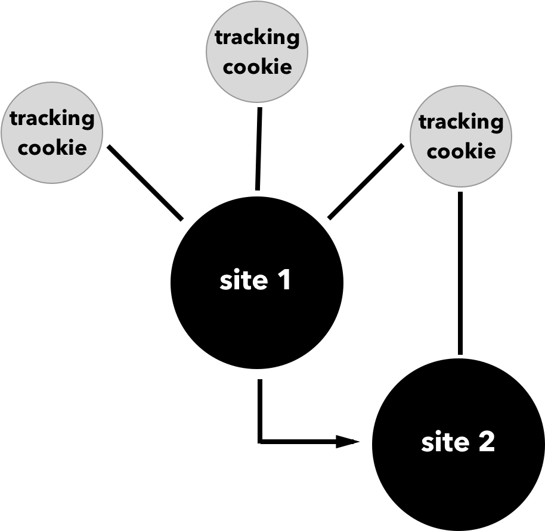
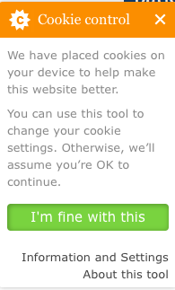
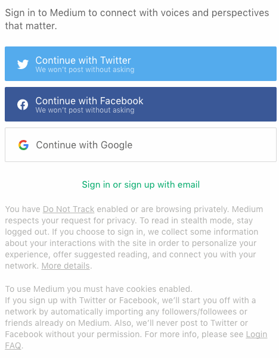

# Respecting user privacy

This has happened to all of us, one evening we're shopping for something mundane like new bed sheets by reading reviews and browsing a few online retailers and the next time we open one of our favorite websites up pops an ad for bed linens. What's going on here? Even for those of us that spend our days (and nights) developing for the web this can be confounding. How does the site have access to our shopping habits? And just how much do these sites know about us?

This feeling of helplessness is not uncommon. According to the [Pew Research Center](http://www.pewresearch.org/fact-tank/2016/01/20/the-state-of-privacy-in-america/), 91% of American adults "agree or strongly agree that consumers have lost control of how personal information is collected and used by companies." Many users may be comfortable giving away information in exchange for products and services, but more often than not the depth and breadth of that information is unclear to the user. Meanwhile, advertising networks and social media sites have bits of code that are spread across the web, tracking users between sites.

As web developers how can we work to maintain the privacy or our users? In this chapter we'll look at how web tracking works and ways in which we can hand greater privacy controls back to our users.


## How Users are Tracked

As users browse the web, they are being tracked and, as web developers, we are often enabling and supporting that surveillance. This isn't a case of tin-foil hat paranoia as we introduce the code of ad networks to support our work, add social media share buttons that allow users to easily share our site's content, or use analytics software to help us better understand user experience. These sites track user behavior with the intention of providing them with a more unique experience. While this may seem harmless or well intended, this is typically done without the knowledge or permission of the end-user.

The simplest way that web tracking works is that a user visits a site which installs a cookie from a third-party. When we visit another site with the same third-party tracker, the tracker is notified. This allows the third-party to build a unique user profile.



The intention of this tracking is typically to provide more targeted services, advertising, or products. However, the things we buy, the news we read, the politics we support, and our religious beliefs are often embedded into our browsing history. To many, without explicit permission this knowledge feels intrusive.


## What does your browser know about you?

Those aware of user use tracking may take a few steps to beat trackers at their own game. Ad blockers such as [uBlock Origin](https://github.com/gorhill/uBlock/) block advertisements as well as third-party advertising trackers. Other browser extensions such as [Privacy Badger](https://www.eff.org/privacybadger) and [Ghostery](https://www.ghostery.com/) attempt to block all third-party beacons from any source. However, even with tools like these, sites may be able to track users based on the unique footprint their browser leaves behind. In fact, the irony of using these tools according to the W3C slide deck [Is preventing browser fingerprinting a lost cause?](https://www.w3.org/wiki/images/7/7d/Is_preventing_browser_fingerprinting_a_lost_cause.pdf), is that "fine grained settings or incomplete tools used by a limited population can make users of these settings and tools easier to track."

Browser's can easily detect the user's IP address, user agent, location, browser plugins, hardware, and even battery level. Web developer Robin Linus developed the site [What every browser knows about you](http://webkay.robinlinus.com/) to show off the level of detail available to developers and site owners. Additionally, the tools [Am I Unique?](https://amiunique.org/) and [Panopticlick](https://panopticlick.eff.org) offer quick overviews of how unique your browser fingerprint is.

<aside>

If you're interested in learning more about privacy and user tracking, I highly recommend the online documentary, [Do Not Track](https://episode1.donottrack-doc.com/).

</aside>


## Do Not Track

With this information about the ways in which users can be tracked, how can we, as web developers, advocate for our user's privacy? My belief is that the first step is to advocate for the respect of the [Do Not Track](https://www.w3.org/TR/tracking-compliance/)(DNT) browser setting. Do Not Track is a browser setting that allows users to specify a preference to not be tracked by the sites they visit. When a user has enabled the Do Not Track setting in their browser, the browser responds with the HTTP header field `DNT`.

According to the [Electronic Frontier Foundation](https://www.eff.org/pages/understanding-effs-do-not-track-policy-universal-opt-out-tracking), Do Not Track boils down to sites agreeing not to collect personally identifiable information through methods such as cookies and fingerprinting as well as agreeing not to retain individual user browser data beyond 10 days. The noted exceptions to this policy are when a site is legally responsible for maintaining this information, the information is needed to complete a transaction, or if a user has given explicit consent.

With Do Not Track enabled, browsers send an HTTP header response with a `DNT` value of `1`:

```
Host: "www.example.com"
Accept: "text/html,application/xhtml+xml,application/xml;q=0.9,*/*;q=0.8"
Accept-Language: "en-US,en;q=0.5"
Accept-Encoding: "gzip, deflate, br"
DNT: "1"
```

Do Not Track does not automatically disable tracking in a user's browser. Instead, as developers, we are then responsible for appropriately handling this user request in our applications.


<aside>
**Enabling Do Not Track**

If you are interested in enabling Do Not Track in your browser, or would like to direct others to do so. The site [All About Do Not Track](https://allaboutdnt.com/) has helpful guides for enabling the setting for a range of desktop and mobile browsers.

</aside>

### Detecting Do Not Track

We can easily detect and respond to Do Not Track on the client side of our applications in client-side JavaScript by using `navigator.doNotTrack`. This will return a value of `1` for any user who has enabled Do Not Track while returning `0` for a user who has opted in to tracking and `unspecified` for users who have not enabled the setting.

For example we could detect for the Do Not Track setting and avoid setting a cookie in a user's browser:

```
// store user do not track setting s a variables
var dnt = navigator.doNotTrack;

if (dnt !==1) {
  // set cookie only if DNT not enabled
  document.cookie = 'example';
}
```

The site [DoNotTrack.us](http://donottrack.us/), created and maintained by Stanford and Princeton researchers Jonathan Mayer and Arvind Narayanan, helpfully offers web server configurations and templates for web application frameworks in ASP, Java, Perl, PHP, and Django.

Here is the recommended code when working with the Django framework, which offers a good example for any framework or language:

```
DoNotTrackHeader = "DNT"
DoNotTrackValue = "1"

pyHeader = "HTTP_" + DoNotTrackHeader.replace("-", "_").upper()

# request is an HttpRequest
if (pyHeader in request.META) and (request.META[pyHeader] == DoNotTrackValue):
	# Do Not Track is enabled
else:
	# Do Not Track is not enabled
```

Since [DoNotTrack.us](http://donottrack.us/) does not offer a Node.JS example of detecting Do Not Track, here is a simple HTTP Server that will check for the DNT header response from a user's browser:

```
var http = require('http');

http.createServer(function (req, res) {

  var dnt = req.headers.dnt === '1' || false;

  if (dnt) {
    // Do Not Track is enabled
  } else {;
    // Do Not Track is not enabled
  }

	res.end();
}).listen(3000);
```

Additionally the npm package [tinfoilhat](https://www.npmjs.com/package/tinfoilhat) offers an interface for detecting the Do Not Track setting in Node and executing a callback based on the user's setting.

Based on these examples, we can see that detecting a user's Do Not Track setting is relatively straightforward. Once we have taken this important first step, how do we handle Do Not Track requests?

### Respecting Do Not Track

The Mozilla Developer Network helpfully offers [Do Not Track case studies](https://developer.mozilla.org/en-US/docs/Web/Security/Do_not_track_field_guide/Case_studies) and the site DoNotTrack.us provides a [Do Not Track Cookbook](http://donottrack.us/cookbook/), which explore a number of Do Not Track usage scenarios. The examples include practical applications of Do Not Track for advertising companies, technology providers, media companies, and software companies.


### Sites that Respect Do Not Track

Some well known social sites have taken the lead on implementing Do Not Track. Twitter [supports Do Not Track](https://support.twitter.com/articles/20169453?lang=en) by disabling tailored suggestions and tailored ads when a user has the setting enabled. However, it's worth noting that Twitter does not disable analytic tracking or third-party advertising tracking that uses Twitter data across the web. Pinterest [supports Do Not Track](https://help.pinterest.com/en/articles/we-support-do-not-track) and according to the site's [Privacy Policy](https://help.pinterest.com/en/articles/personalization-and-data), a user with Do Not Track enabled is opted out of Pinterest's personalization feature, which tracks users around the web in order to provide further customization of Pinterest content.

Medium.com has a [clear and effective Do Not Track Policy](https://medium.com/policy/how-we-handle-do-not-track-requests-on-medium-f2b4b4fb7c5e). When a user with Do Not Track enabled is logged in, they are presented with this message:

> You have Do Not Track enabled, or are browsing privately. Medium respects your request for privacy: to read in stealth mode, stay logged out. While you are signed in, we collect some information about your interactions with the site in order to personalize your experience, offer suggested reading, and connect you with your network. More details can be found here.

Medium also states that they do not track users across other websites around the web. This policy is clear and consistent, providing a strong example of how a successful site can respect a user's Do Not Track setting.

The site DoNotTrack.us offers a [list of additional companies who have committed to honoring Do Not Track](http://donottrack.us/implementations), including advertising companies, analytics services, data providers, and more. Unfortunately this list appears to be incomplete and outdated, but offers a good jumping off point for exploring exemplars across a range of industries.

## Web Analytics

One of the biggest challenges of handling user privacy is determining best practices for web analytics. By definition, the goal of web analytics is to track users, though the aim is typically to better understand how our sites are used so that we can continually adapt and improve them to user needs.

To improve user privacy, when using analytics, we should ensure that our analytics provider anonymizes our users, limits tracking cookies to our domain, and that it does not share user information with third parties. The [US Government's digital analytics program](https://analytics.usa.gov/#explanation) has taken this approach, through ensuring that Google Analytics does not track individuals, share information with third parties, and anonymizes all user I.P. addresses.

As an additional example, the analytics provider [Piwik](https://piwik.org) actively seeks to [maintain user privacy](http://piwik.org/blog/2014/01/data-privacy-day-january-28th/) while working with user analytics through:

- Providing an analytics opt-out mechanism
- Deleting logs older than a few months
- Anonymizing IP addresses
- Respecting Do Not Track
- Setting a short expiration date for cookies

These provide a good baseline for how we should aim to handle analytics on our site with any provider. By taking this extra care with user information, we may continue to use analytics to provide greater insights into use of our sites while maintaining user privacy.

## De-identification

Though avoiding the tracking of users completely is preferred, there may be instances where this choice is outside of our control as web developers. In these cases, we may be able to guide the decision to de-identify collected user data, ensuring that the privacy of our users remains intact. The goal of any de-identification is to ensure that any collected data cannot be used to identify the person who created the data in any way.

However, de-identification is not without its limitations, as de-identified data sets can be paired with other data sets to identify an individual. In the paper [No silver bullet: De-identification still doesn't work](http://randomwalker.info/publications/no-silver-bullet-de-identification.pdf) Arvind Narayanan and Edward W. Felten explore the limits of de-identification. Cryptographic techniques such as [differential privacy](https://en.wikI.P.edia.org/wiki/Differential_privacy) can be used as another layer to help to limit the identification of individual users within collected datasets.

## User Consent and Awareness

In 2011 the European Union passed legislation requiring user consent before using tracking technology. Specifically the [privacy directive states](http://eur-lex.europa.eu/LexUriServ/LexUriServ.do?uri=CELEX:32002L0058:EN:HTML):

> Member States shall ensure that the use of electronic communications networks to store information or to gain access to information stored in the terminal equipment of a subscriber or user is only allowed on condition that the subscriber or user concerned is provided with clear and comprehensive information in accordance with Directive 95/46/EC, inter alia about the purposes of the processing, and is offered the right to refuse such processing by the data controller.

This means that any site using cookies, web beacons, or similar technology must inform the user and receive explicit permission before tracking the user. If you live in Europe or have visited a European website, you are likely familiar with the common request to track banner. This law is not without [controversy](http://celso.io/2016/01/31/cookies.html) as many feel that these banners are ignored, viewed as a nuisance, or otherwise not taken seriously.

In the UK, the guidance has been to simply inform users that they are being tracked, providing no option to opt-out. For example, the site [ico.org.uk](https://ico.org.uk), the "UK’s independent authority set up to uphold information rights in the public interest, promoting openness by public bodies and data privacy for individuals," opts users in, but clicking the "Information and Settings" link provides information about browser settings and disabling cookies on the site.



Though based in the United States, the site Medium.com alerts users, with DNT enabled, how their information will be used and expresses consent when a user is logging in. For a private experience, Medium recommends remaining logged out and commits to not tracking those users.



### Creating a Do Not Track Policy

While there is value in informing users, I believe that the best way to provide privacy controls to users is by respecting the "Do Not Track" browser setting. This allows users to set a privacy preference once and forget it, rather than maintaining individual settings across the web. Since there is no absolute definition of what Do Not Track encompasses, to effectively implement it you will likely need to develop a DNT policy for your site or application.

The Electronic Frontier Foundation(EFF) provides a [sample Do Not Track policy](https://www.eff.org/dnt-policy). This document serves as a solid foundation for any site's Do Not Track policy and can be used verbatim or adapted for an organization's needs. EFF also provides a set of [frequently asked questions](https://www.eff.org/dnt-policy#faq) and a [human readable summary](https://www.eff.org/pages/understanding-effs-do-not-track-policy-universal-opt-out-tracking) of the policy.

By committing to a Do Not Track policy we are able to ensure that we comply with the tracking preferences of our users.

## Further Reading

- [The Emerging Ethical Standards for Studying Corporate Data](http://www.recode.net/2016/6/14/11923286/facebook-emotional-contagion-controversy-data-research-review-policy-ethics) by Jules Polonetsky and Dennis Hirsch
- [Do Not Track Is No Threat to Ad Supported Business](https://cyberlaw.stanford.edu/blog/2011/01/do-not-track-no-threat-ad-supported-businesses) by Jonathan Mayer
- [Electronic Frontier Foundation's Guide to Do Not Track](https://www.eff.org/issues/do-not-track)
- [W3C: Tracking Compliance and Scope](https://www.w3.org/TR/2015/WD-tracking-compliance-20150714/)
