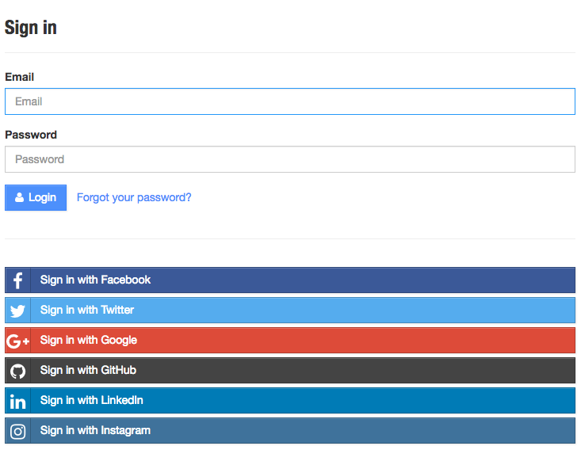
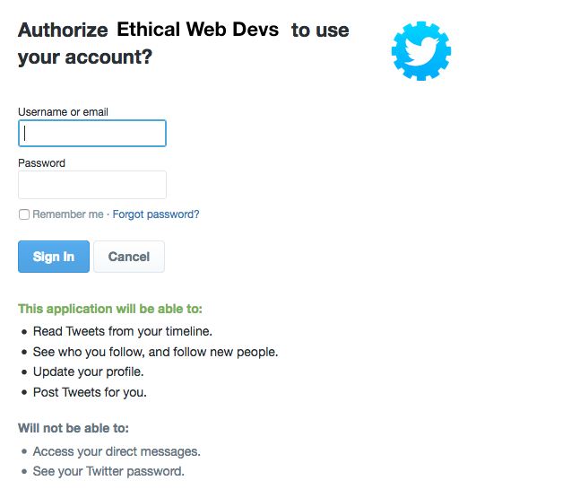

# Securing User Data

Early in my web development career I took on a freelance role with a small retail company. Part of the company's business model was catering to corporate clients. Generally, I was doing small site maintenance that involved updating HTML, CSS, and Perl code developed a few years earlier by a (likely more expensive) consulting company. A few days into the job I was familiarizing myself with the codebase when I came across a file named `cc.txt`. This file contained the credit card information of hundreds of corporate clients, stored as plain text. I quickly deleted the file from my local machine and, I'm pretty sure, closed the laptop lid and backed away from the computer slowly. In the end, I advised the company that this needed fixed, told them they should hired someone more experienced than me to do it, and asked that I be let out of the contract. I hope they took that advice.

It seems like every few weeks there's a major breach that leaks user information. Brian Krebs does a good job of cataloging major breaches on his site [krebsonsecurity.com](http://krebsonsecurity.com/category/data-breaches/). Here a few highlights that have been heavily covered by the news media:

- In 2015 it was uncovered that the United States Government's Office of Personnel Management (OPM) had undergone a data breach containing millions of government employee records. These records included security clearance information, personal fingerprints, and fingerprints. [^1: https://en.wikipedia.org/wiki/Office_of_Personnel_Management_data_breach]
- The extramarital dating website, Ashley Madison, was infamously breached in 2015. Revealing user information such as names, addresses, email addresses, and phone numbers. [^2: https://www.wired.com/2015/08/happened-hackers-posted-stolen-ashley-madison-data/]
- In 2015 the insurance provider Anthem Inc. was breached. In this breach hackers stole over 78 million records containing names, birthdays, medical IDs, social security numbers, street addresses, e-mail addresses and employment information [^3: https://en.wikipedia.org/wiki/Anthem_medical_data_breach].
- In 2016 the professional social network LinkedIn announced that they had been breached in 2012 and that hackers had released a data set containing over 100 million user email addresses and hashed passwords. [^4: https://blog.linkedin.com/2016/05/18/protecting-our-members]
- In 2016 the file syncing service Dropbox also announced a 2012 breach, which included account information for over 60 million of its users. [^5: https://motherboard.vice.com/read/hackers-stole-over-60-million-dropbox-accounts]

It's not all doom and gloom, however. The web is a wonderful place and a reflection of both the positives and negatives of our society. Just as we wouldn't leave our front door wide open when we're not at home, there are steps we can take to lock the doors of our web applications. Taking these steps will help protect the valuable information our users share with us. In this chapter we'll explore the basics of web development security.

---

**ASIDE**

Security is a challenging topic and something that can (and should!) be explored much more deeply than possible in a single chapter. There are books and entire careers dedicated to this topic. My hope is that this chapter will give you a high-level overview of the basics. The Further Reading section at the end of this chapter contains articles, guides, and books that dive deeper into web security.

---

## Build On A Strong Foundation

Being a web developer means that we are constantly learning about and using new tools. It's an exciting perk of the job. That said, when building secure applications we are often best-served to use established frameworks that have been thoroughly vetted and that provide baked-in security support. As an example, let's look at the security options when building a web application with Python or Node.js.

The Python environment is relatively stable and most web applications are built using either the [Django](https://www.djangoproject.com/) or [Flask](http://flask.pocoo.org/) web frameworks. Django provides [many security features out of the box](https://docs.djangoproject.com/en/1.10/topics/security/), such as cross site scripting, SQL injection, and clickjacking protection. As Flask is an intentionally more lightweight framework, it comes with a few [built-in security features](http://flask.pocoo.org/docs/0.10/security/), such as lightweight cross site scripting protection. Additional security features can be added with the [Flask-Security](https://pythonhosted.org/Flask-Security/) extension.

Node.js is notorious for it's rate of change and the number of frameworks and libraries available to developers. It can be both something to love about the platform as well as a frustation point for many developers. The site [Node Frameworks](http://nodeframework.com/) attempts to catalog them all. Despite there being dozens of Node.js web framework options, when considering security we are likely to be best-served by choosing an established framework that is used in production by other web applications, such as [Express](http://expressjs.com/).

Similar to Flask, Express is a lightweight application framework, but there are several plugins that enhance its security features. The two most common plugins are [Lusca](https://github.com/krakenjs/lusca), which was developed by PayPal, and [Helmet](https://github.com/helmetjs/helmet). These both add sensible defaults for features such as cross-site scripting protection, cross-site request forgery protection, content security policy settings, and more.

In addition to using security focused libraries, we should also work to ensure that our dependencies are up to date and free of known vulnerabilities.

In Python we can check for outdated pip installed packages with:

```
pip list --outdated
```

Similarly in Node.js we can list outdated packages with npm:

```
npm outdated
```

In addition to these manual methods there are tools that will help maintain dependency updates and scan for security vulnerabilities. [Greenkeeper](https://greenkeeper.io) is a tool which will scan your project for outdated Node.js dependencies and will create a pull request with the updates. Greenkeeper will also run your application's test suite, ensuring that the updated dependency does not break the build. [Snyk](https://snyk.io/) is a tool that will scan Node.js packages for known vulnerabilities and alert you to insecure dependencies. The site also provides a command line tool for fixing these vulnerabilities.

Though these examples are limited to Python and Node.js, I hope that you can see how the concepts map to your web stack of choice. When we use established technologies and utilize built-in or plugin-based security features, we are creating a solid security foundation for our site.

## OWASP Top 10

Now that we've started our application off on a strong foundation, it's worth exploring the common security vulnerabilities that we should be aware of. Every few years the Open Web Application Security Project (OWASP) publishes a [list of the most critical web application security flaws](https://www.owasp.org/index.php/Category:OWASP_Top_Ten_Project). Being aware of this list of common vulnerabilities can provide us with an awareness of potential weaknesses in our own applications.

1. Injection
2. Broken authentication and session management
3. Cross-site scripting
4. Insecure direct object reference
5. Security misconfiguration
6. Sensitive data exposure
7. Missing function level access control
8. Cross-site request forgery
9. Using components with known vulnerabilities
10. Unvalidated redirects and forwards

## Secure User Authentication

When a user creates an account with our site they are placing their trust in us. Often in this process the user may agree to a terms of service about how they may interact with our site and services and the site owners will use the data and information they create within the application. One crucial step in upholding out end of this agreement is to ensure that a user's login information is secure and private. Let's explore how we can do so.

### Creating Your Own Login System

When creating our own authorization system it is critical that we send this information over an HTTPS connection, as discussed in the previous chapter, and that we effectively obscure our user's passwords when stored in our database. To effectively store user passwords we should use a combination of hashing and salting.

Hashing is the act of obscuring a string of text by turning it into a seemingly random string. Hashing functions are "one way," meaning that once the text is hashed it cannot be reversed back to the original string. When hashing a password, the plain text of the password is never stored in our database.

Salting is the act of generating a random string of data that will be used in addition to the hashed password. This ensures that even if two user passwords are the same, the hashed and salted version will be unique.

`bcrypt` is a popular hashing function, based on the [blowfish cipher](https://en.wikipedia.org/wiki/Blowfish_(cipher), and is commonly used with in a range of web frameworks. In Node.js we can use the [bycrypt module](https://www.npmjs.com/package/bcrypt) to both salt and hash our passwords.

First we install bycrypt with `npm`:

```
npm install bcrypt --save
```

Then in our application code we would require the module and write a function to handle the salting and hashing using `bcrypt`.

```
// require the module
var bcrypt = require('bcrypt');

// the cost of processing the salting data, 10 is the default
const saltRounds = 10;

// function for hashing and salting
function passwordEncrypt(username, password) {
  // generate the salt
  bcrypt.genSalt(saltRounds, function(err, salt) {
    // generate the hash
    bcrypt.hash(password, salt, function(err, hash) {
      // store username, hash, and salt in your password DB.
    });
  });
}
```

In the above example, I could passed a password of `PizzaP@rty99`, which generated a salt of `$2a$10$HF2rs.iYSvX1l5FPrX697O` and the hashed & salted password of `$2a$10$HF2rs.iYSvX1l5FPrX697O9dYF/O2kwHuKdQTdy.7oaMwVga54bWG` (which is the salt plus an encrpyted password string). Now when checking a user's password against the hashed and salted password, I can use bcrpyt's `compare` method.

```
// password is a value provided by the user
// hash is retrieved from our DB
bcrypt.compare(password, hash, function(err, res) {
  // res is either true or false
});
```

All other major web frameworks also support the use of `bcrypt`. For example, [Django's documentation](https://docs.djangoproject.com/en/1.10/topics/auth/passwords/#using-bcrypt-with-django) provides an excellent overview of integrating `bcrypt` into an application. Though `bcrpyt` is a popular and easy to implement hashing function, there are several other effective options available such as  [PBKDF2](https://en.wikipedia.org/wiki/PBKDF2) and [scrypt](https://en.wikipedia.org/wiki/Scrypt). I won't debate the benefits and merits of these individually, but when implementing a login system I encourage you to research each and choose the implementation most appropriate for your application.

### OAuth 2.0

An alternate option to providing your own login system is to make use OAuth 2.0. OAuth 2.0 is a user authorization system that allows us to provide a user login option through popular third-party sites such as Google, Facebook, Twitter, LinkedIn and more. This allows us to both rely on large and trusted third-parties for providing authentication as well as pull in useful user information, as authorized by the user, from the chosen service.

Even if you have never used OAuth as a developer, you are likely familiar with the flow from the perspective of a user.

First, s user clicks a "Log In" link from our application.


Image from the Hackathon Starter Kit, https://github.com/sahat/hackathon-starter

Next, the user is then directed to an access request for the specified service provider. This request details the level of access to user information that the accessing application will have.



If the user grants the authorization, the service redirects the user back to our site with an authorization code. Our server will then exchange the authorization code for an access token. Once granted the access token, that will be used to access the user information from the third-party service.

Links to libraries for popular programming languages and web frameworks, tutorials, and documentation can be found at the OAuth website, [https://oauth.net/](https://oauth.net/)/. Additionally, Aaron Parecki the maintainer of OAuth, has written the fantastic guide, [OAuth 2 Simplified](https://aaronparecki.com/2012/07/29/2/oauth2-simplified).

### Password Strength

Strong user passwords are good for security, but giving users requirements such as characters the password must contain and a required length will often frustrate users. Some are even just [plain silly](https://xato.net/worst-password-policy-ever-8b01b7eaa6db#.w4tntygj5). Worst of all, these passwords may be event less secure as it provides potential hackers with guidelines for password formats when attempting brute force penetration. Additionally, users who don't use password management software are likely to look for workarounds or write them down or store the password somewhere less secure.

If you would like to guide users to using more secure passwords a better alternative is to use a password strength estimator. The Carnegie Mellon University study ["How Does Your Password Measure Up? The Effect of Strength Meters on Password Creation"](https://www.usenix.org/system/files/conference/usenixsecurity12/sec12-final209.pdf) measured the impact of password strength meters and password requirements:

> We found that meters with a variety of visual appearances led users to
create longer passwords. However, significant increases
in resistance to a password-cracking algorithm were only
achieved using meters that scored passwords stringently.
These stringent meters also led participants to include
more digits, symbols, and uppercase letters.

I'm a big fan of the Dropbox library [zxcvbn](https://blogs.dropbox.com/tech/2012/04/zxcvbn-realistic-password-strength-estimation/). The usage of this plugin is reasonably simple, but more importantly it is based on a really sound methodology for determining password strength, which the Dropbox team has helpfully detailed.

If your organization is interested in password requirements, steering instead towards to require password strength indicators may provide a better experience for users as well as lead to better password security.

### Multi-Factor Authentication

One way we can provide a more secure authentication system to our users is by making multi-factor authentication available. Multi-factor authentication is done by combining two more or more of the following:

1. A secret known to the user, such as a password or PIN.
2. A physical object in the user's possession, such as a mobile phone or a physical USB FIDO U2F [Security Key](https://support.google.com/accounts/answer/6103523).
3. A physical characteristic of the user, such as a fingerprint, eye iris, or typing speed.

In web applications, the most common pattern is to make available two factor authentication by providing a physical authentication in addition to the standard username/password flow. Often, users will receive a text message to their mobile phone or install a multi-factor authentication application that will provide the appropriate code for this additional verification step. Adding a physical dimension reduces the possibility of password theft providing access to a user's account. Though many users may opt not to enable two-factor authentication, providing this option is a good step towards better security of standard username and password authentication.

---

**ASIDE**

The least secure part of any login system is the human using it. Weak and shared passwords, phishing, and insider threats, are the weakest points of any authenticated system.

---

### Other types of authentication:
    - n-factor
    - one-time passwords
    - biometrics
    - blockchain


### User Sessions

## Encrypting User Data

## Sanitizing Data

## Security Headers

## Bug Bounty Programs and Security Disclosures

https://titanous.com/posts/security-disclosure-policy-best-practices

https://bounty.github.com/

## Additional Tools
  - Chrome Security Panel
  - Code sniffing

## Conclusion

## Further Reading

- [Awesome AppSec](https://github.com/paragonie/awesome-appsec)
- [A practical security guide for web developers ](https://github.com/FallibleInc/security-guide-for-developers/blob/master/README.md)
- [Python & Django Security on a Shoestring: Resources](http://nerd.kelseyinnis.com/blog/2016/05/30/python-django-security-on-a-shoestring-resources/) by Kelsey Gilmore-Innis
- [Mozilla Cybersecurity Delphi 1.0: Towards a user-centric policy framework](https://blog.mozilla.org/netpolicy/files/2015/07/Mozilla-Cybersecurity-Delphi-1.0.pdf)
- [Identity and Data Security for Web Development](http://shop.oreilly.com/product/0636920044376.do) by Jonathan LeBlanc, Tim Messerschmidt
- [Security for Web Developers](http://shop.oreilly.com/product/0636920041429.do) by John Paul Mueller
- [XATO: Security](https://xato.net/)
- [xkcd: Password Strength](https://xkcd.com/936/)
