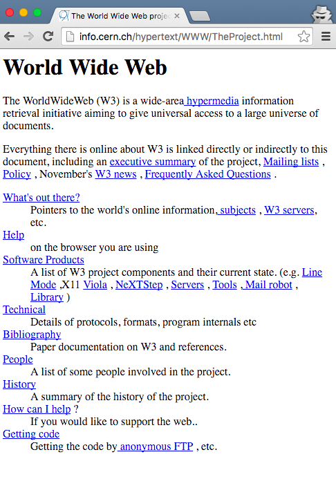

# Responsive Design

For more than a decade of the web’s existence, we could safely assume that each user of our site would be accessing it through a computer screen. Despite this, early websites were, by default, adaptive to a variety of screen sizes. The web’s first site, Tim Berners-Lee’s [World Wide Web](http://info.cern.ch/hypertext/WWW/TheProject.html), works beautifully at a range of  screen sizes.[^1]



Despite this, we spent time researching and considering the typical browser width and assumed that our users would be perched in front of a reasonably large screen, with a dedicated keyboard. With the evolution of the smartphone, those assumptions have changed. Users may access our sites quickly, on the go, from a wide range of screen sizes. With the diversity of devices and screens, we can no longer safely make assumptions about the screen size of our users.

The initial reaction to the rise of smartphones was to create dedicated mobile versions of our sites. This often sat at a `m.`[footnote: such as http://m.example.com] subdomain and provided a mobile optimized experience. At first, this seemed like a great solution as it allowed users to access our services in a format that was streamlined for their device. For developers, this also meant maintaining multiple codebases. For users, this often meant dealing with a limited subset of functionality when using a mobile device.  

Today, the number of devices that connect to the web is rapidly expanding. Users may access our applications from a desktop computer, a mobile phone, a tablet, a reading device, a watch, a video game system, or in their car. The site [Global Stat Counter](http://gs.statcounter.com/#resolution-ww-monthly-201505-201605) reports that 119 different screen resolutions have accessed the web over the past year.

In 2010, Ethan Marcotte coined the term [Responsive Design](http://alistapart.com/article/responsive-web-design), to describe the practice of building web sites that adapt to a range of screen sizes. By building responsively, we can develop a single codebase that acclimates to the screen size of the device being used by the user. This allows us to make fewer assumptions while delivering a site that works in any context.

Responsive design consists of three core elements:

- **Fluid grids** allow the layout of the screen to condense and expand to fill the screen size, rather than providing a strict width.
- **Flexible media** means that our images and videos are also not limited by a pre-determined width, but an adapt with the content of the page.
- **Media queries** are a CSS technique that allow developers to apply different CSS rules in varying contexts.

By combining these three browser capabilities, we are able to develop sites for a wide range of browser sizes. When we build responsively, we are ensuring that our sites are delivered to our users in a way that works well in the context that they are accessing our site.

[^1]: Though Berners-Lee’s first website adapts to any browser width, it still scales on most mobile browsers due to browser behavior. As we will discuss later in the chapter, adding a viewport meta tag to our HTML prevents this from happening.

## Process

> Responsive design is not about “designing for mobile.” But it’s not about “designing for the desktop,” either. Rather, it’s about adopting a more flexible, device-agnostic approach to designing for the web.

— [Ethan Marcotte](http://unstoppablerobotninja.com/entry/toffee-nosed/)

The process of responsive design can be broken down into four steps.

1. Set the browser viewport to adapt to the screen size.
2. Set flexible media elements that can adapt to the width of the container.
3. Develop a [device agnostic](http://trentwalton.com/2014/03/10/device-agnostic/) baseline experience.
4. Using CSS3 media queries, enhance the experience at a variety of screen sizes (often termed “break points”).

Let’s tease this process apart by creating a very simple responsive page.

By default, mobile browsers will render the page at a desktop screen width. This means that users will need to pinch and zoom to be able to read and access our content. To tell the browser to scale, we can add a meta viewport tag to the `<head>` of the HTML document.

```
<meta name="viewport" content="width=device-width, initial-scale=1">
```

The most basic approach to responsive media to scale our images and other media elements to the width of their parent container. In our CSS file we apply a `max-width: 100%` to media objects to ensure that they never overflow beyond the container width. In chapter 4, we will explore how to serve various image sizes depending on browser context.

```
img,
obj,
video {
  max-width: 100%;
  height: auto;
}
```


With the baseline of a scaled browser viewport and flexible media, we can begin developing the core experience. The core experience can encompass things such as typography, color, and base styles that should appear in all browsers. By doing so, we ensure that every user is served a site that will work well in their browser regardless of capability. Originally, this approach was termed mobile first, but I’ve come to favor Trent Walton’s description of [device agnosticism](http://trentwalton.com/2014/03/10/device-agnostic/). By taking this approach, we are developing in a future friendly way that is prepared for devices of all sizes[^2].

With our baseline styles in place, we can begin adding styles based on browser width. To do this, we use CSS media queries, which allow us to apply specific styles to given browser widths. These can and should be based on the ideal conditions of our application content. For the purpose of responsive design, we’ll focus on `max-width` and `min-width` media queries.

A `max-width` media query allows us to define styles that will only appear up until a certain breakpoint.

```
@media (max-width: 600px) {
  /* Smaller device/browser styles go here */
}
```

In contrast, `min-width` media queries allow us to set styles that are only applied at larger browser sizes.

```
@media (min-width: 601px) {
  /* Larger device/browser styles go here */
}
```

In the end, we may wind up with a style sheet that is structured  with base styles followed by media queries defining styles for various browser sizes, often termed breakpoints.

```
/* Base Styles */

@media (max-width: 600px) {
  /* Smaller device/browser styles */
}

@media (min-width: 600px) {
  /* Large device/browser styles */
}

@media (min-width: 850px) {
  /* Larger device/browser styles */
}

@media (min-width: 1100px) {
  /* Largest device/browser styles */
}

```

By using breakpoints, we can define styles based on the context of the user’s browser, adapting the content of our site to better meet their needs.

[^2]: Brad Frost demonstrating a project from 2013 on an Apple Watch https://youtu.be/BzckCgE5glI

### Note: CSS Frameworks

If you are not a fan of writing CSS (and who could blame you?), you may opt to use a CSS framework such as [Bootstrap](https://getbootstrap.com/) or [Foundation](http://foundation.zurb.com/). These and many other UI frameworks are responsive by default and can be useful for rapid prototyping and quick interface development.

## Considerations

When developing a responsive design there are a number of conditions a developer should take into account. Primarily, we should avoid making assumptions about user context and build for non-ideal conditions.

Some of the key considerations for developing responsive designs:

- Provide users with large click areas for links and buttons.
- Ensure that site navigation is accessible and easy to understand.
- Make forms as simple as possible and autofill form content when possible.
- Focus on the content of the application and set breakpoints accordingly, rather than by common device sizes.


## Further Reading

- [Responsive Design](http://alistapart.com/article/responsive-web-design)
- [This is Responsive](https://bradfrost.github.io/this-is-responsive/index.html)
- [Responsive Web Design, 2nd Edition](http://shop.oreilly.com/product/9781937557188.do)