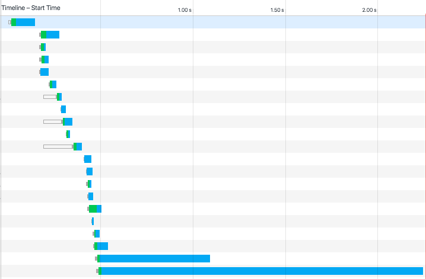
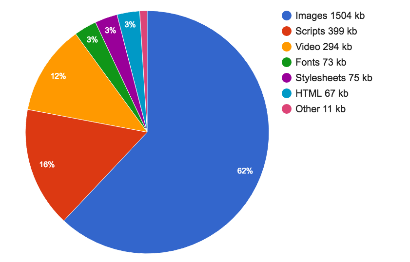
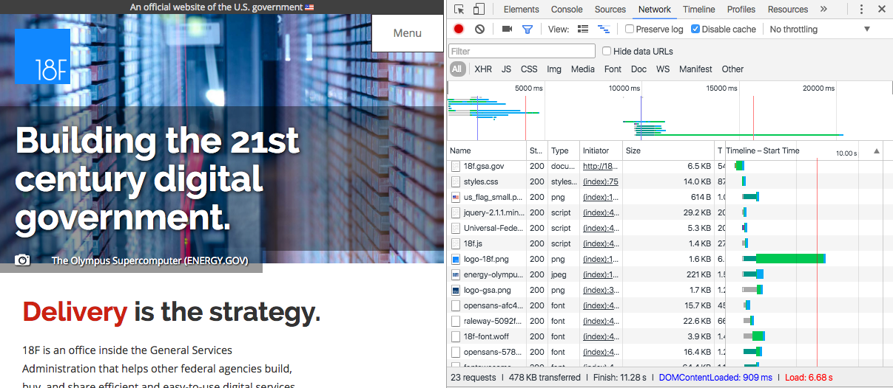
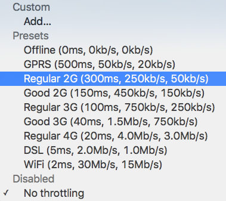
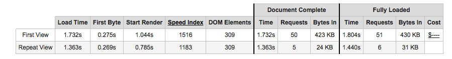
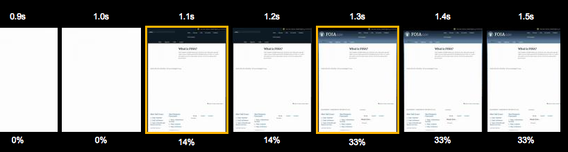

# Web performance

Each Tuesday morning, when a Facebook employee logs in to Facebook, they are presented with an option to try out the app on a slower connection for an hour. This is part of an initiative they call [2G Tuesdays](http://www.businessinsider.com/facebook-2g-tuesdays-to-slow-employee-internet-speeds-down-2015-10), as an attempt to recognize the importance and challenges of designing and developing applications that are served over a variety of network conditions. 

As developers, we often have access to good hardware and quick web connections, but this may not always be the case for our users. Even those of us who live in major cities may experience variable network conditions, clogged or throttled by overuse. When we build our sites and applications with a performance mindset, we benefit all of our users.  


Internet connection speeds: https://www.akamai.com/us/en/multimedia/documents/state-of-the-internet/akamai-state-of-the-internet-report-q3-2015.pdf


## File size

> 80% of the end-user response time is spent on the front-end
– [Steve Sounders](https://developer.yahoo.com/blogs/ydn/high-performance-sites-rule-1-fewer-http-requests-7163.html)

As of writing, the average web page requires a user to download roughly 2.3MB worth of data[^1]. Using this metric, the first 5.25 inch hard drive, the 1980 Seagate ST-506, would be able to hold just two modern web pages. 


With varying connection speeds around the world, the cost of accessing our site’s can differ. The tool [What does my site cost?](https://whatdoesmysitecost.com) seeks to provide insight into the real-world data costs of sites accessed over a mobile connection. In many parts of the world, the cost of 500MB of data far exceeds the hourly minimum wage[^1].

Here is the cost of a few different sites when accessed in various parts of the world:

[TODO: FORMAT AS TABLE?]

[Wikipedia Article](https://whatdoesmysitecost.com/test/160430_G5_b0f0622361ae1d0fffe2eeaf5d43fbbb)
Size: 0.23MB
Canada: $0.03
Botswana: $0.02
USA: $0.01
France: $0.00

[TheVerge.com Apple Watch Review](https://whatdoesmysitecost.com/test/160430_95_260026b8ebd320ee3087393fdea12525)
Size: 8.02MB
Canada: $0.98
Botswana: $0.60
USA: $0.51
France: $0.16

[Google+](https://whatdoesmysitecost.com/test/160430_VQ_5597117e2bdb01ddfe4b3400826d84e3)
Size: 2.05MB
Canada: $0.25
Botswana: $0.15
USA: $0.13
France: $0.04

To decrease the footprint of our websites, we can aim to:

1. Minimize the number of resources
2. Optimize files, images, and fonts
3. Serve responsive images
4. Leverage gzip and caching

By putting these four best practices in action, we ensure that our site’s users are transferring the lowest amount of data from our servers to their devices.

[^1]: https://blog.jana.com/2015/01/26/the-data-trap/

### Number of Resources

Perhaps the biggest impact we can have on reducing data transfer for first time users is to limit the number of resources sent to the user. Each individual resource on a page requires an individual HTTP request. A waterfall chart, such as the ones found in Chrome’s developer tools, shows how long it takes to download each resource.



To reduce the number of requests a browser makes, it is common to bundle files together. We can achieve this through techniques such as bundling CSS and JavaScript into single files and the use of image sprites.


<aside>
### HTTP/2 

The HTTP/2 protocol may challenge some of our assumptions about combining resources. While HTTP/1.1 only services a single server request at a time, HTTP/2 enables multiple simultaneous connections. This means that bundling, inlining, and combining resources may be less effective as we move to the new protocol. In fact, these techniques may slow down our site when served over HTTP/2. 

**To learn more about HTTP/2**: 

- [Rebecca Murphy’s HTTP/2 resources](https://pinboard.in/u:rmurphey/t:http2/)
- [HTTP/2 by Ilya Grigorik](https://www.oreilly.com/learning/http2-a-new-excerpt)
- [HTTP/2 for Web Developers](https://blog.cloudflare.com/http-2-for-web-developers/)
- [http2 explained](https://daniel.haxx.se/http2/)
- [Getting Ready For HTTP/2: A Guide For Web Designers And Developers](https://www.smashingmagazine.com/2016/02/getting-ready-for-http2/)

[^1]: http://www.httparchive.org/trends.php
[^2]: http://caniuse.com/#feat=link-rel-preconnect
[^3]: http://caniuse.com/#feat=link-rel-preload

### Optimizing Files, Images, and Fonts

Once we have reduced the number of http requests being made in our site, the next step is to optimize the files we serve. We can do this by minimizing CSS and JS resources, optimizing and and serving proper images, and making good use of web fonts when used.

#### Minimizing Files

Though white space and line breaks make CSS and JavaScript files readable to humans, they are necessary for the browser to properly parse them. To reduce the file size of these resources we should minimize them for our production sites.

There are several desktop and web applications for minimizing CSS and JavaScript.

- [Closure Compiler](https://closure-compiler.appspot.com/home) - An online tool from Google for minifying JavaScript
- [Online JavaScript/HTML/CSS Compressor](http://refresh-sf.com/) - A single web interface for compressing three file types.
- [Smaller](http://25.io/smaller/) - A Mac OS X tool for HTML, CSS, and JavaScript compression.
- [UglifyJS](http://marijnhaverbeke.nl//uglifyjs) - An online tool for JavaScript minification based on the popular Uglify.js utility.

Desktop and web tools may be great for simple sites or those that aren’t updated frequently, but to minimize effort we can integrate minification into a build process for our site. How this is done may depend on your site’s stack, Ruby on Rails, for example, has an [asset pipeline](http://guides.rubyonrails.org/asset_pipeline.html) for the minification of assets. A common cross-framework approach is to use a build tool such as [Gulp](http://gulpjs.com/), [Grunt](http://gruntjs.com/), or [npm scripts](https://docs.npmjs.com/misc/scripts). For these build tools there are a number of minification plugins. Here are a few that I’ve used with success in the past:

- [node-minify](https://www.npmjs.com/package/node-minify) - A Node interface for minifying both CSS and JavaScript, which utilizes a number of popular compression algorithms.
- [uglify-js](https://www.npmjs.com/package/uglify-js) - A command line utility, written in JavaScript, for minifying JavaScrip.
- **Gulp**: [gulp-clean-css](https://www.npmjs.com/package/gulp-clean-css) - A css minification plugin for Gulp.
- **Gulp**: [gulp-uglify](https://www.npmjs.com/package/gulp-uglify) - A JavaScript minification plugin for Gulp.
- **Grunt**: [grunt-contrib-cssmin](https://www.npmjs.com/package/grunt-contrib-cssmin) - A CSS minification plugin for Grunt.
- **Grunt**: [grunt-contrib-uglify](https://www.npmjs.com/package/grunt-contrib-uglify) - A JavaScript minification plugin for Grunt.

#### Optimizing Images

Images comprise the largest file sizes on a typical web page, taking up more than 60% of the bytes on an average page. By using images well and reducing their file sizes, we can significantly reduce the bandwidth they consume.



To do this we should use the proper image formats, optimize images to reduce file size, and serve the image size needed by the browser.

When creating images, we need to consider their content and choose the most appropriate format. 

- **JPG**: Use for photographs.
- **PNG**: Use as the default for most other static images and images that require transparency.
- **GIF**: Use for simple images. Supports transparency and animation.
- **SVG**: Small file size that scales well and is supported all modern browsers[http://caniuse.com/#feat=svg]. Use for icons, illustrations, and logos.

Once we have chosen the proper file format for an image, we should optimize the image file. Optimizing reduces the file size of an image by applying compression and removing unnecessary information such as metadata, embedded thumbnails, and color profiles. There are a number of desktop and online tools that you may use to manually optimize images:

- [ImageOptim](https://imageoptim.com)
- [imagemin-app](https://github.com/imagemin/imagemin-app)
- [PNG Gauntlet](http://pnggauntlet.com/)
- [Tiny PNG](https://tinypng.com/)
- [ImageAlpha](https://pngmini.com/)
- [JPEG-Optimizer](http://www.jpeg-optimizer.com/)

For sites using a front-end build process, such as Gulp, Grunt, or npm scripts we can bake image optimization into our build process. The Node.js package [imagemin](https://www.npmjs.com/package/imagemin) provides a utility for minimizing images in a number of build environments:

- **Command line interface:** [imagemin-cli](https://github.com/imagemin/imagemin-cli)
- **Gulp**: [gulp-imagemin](https://www.npmjs.com/package/gulp-imagemin)
- **Grunt:** [grunt-contrib-imagemin](https://www.npmjs.com/package/grunt-contrib-imagemin)

#### Optimizing Web Fonts

Web Fonts have provided the ability to add rich typography to our sites. This has been a fantastic development for design, as [95% of Web Design is typography](https://ia.net/know-how/the-web-is-all-about-typography-period). 57% of websites now use custom fonts[^1], with the average web font size of font resources measuring over 138kb[^2]. This means that font resources can account for a fairly large amount of our front-end resources, but through optimization and font-loading techniques we can ensure that custom web fonts do not create a significant performance hit for our site.

The first step to serving improved web fonts is through optimization. The simplest font optimization is to limit the number of styles and weights of a typeface that will be used on the page. Web font services such as Typekit, Google Web Fonts, Webtype, and others allow users to be specific about the styles, weights, and character glyphs required when serving a typeface. If you are self-hosting or using an open source font the tools [Subsetter](http://www.subsetter.com/) or Font Squirrel’s [Web Font Generator](https://www.fontsquirrel.com/tools/webfont-generator) provide the ability to remove glyphs or additional language support, reducing the file size of the font files.

Once we have optimized file size of our typefaces, we can consider how they are served to our users. In Zach Leatherman’s post [How we use web fonts responsibly, or, avoiding a @font-face-palm](https://www.filamentgroup.com/lab/font-loading.html) he points out:

> Some browsers will wait a predetermined amount of time (usually three seconds) for the font to load before they give up and show the text using the fallback font-family. But just like a loyal puppy, WebKit browsers (Safari, default Android Browser, Blackberry) will wait forever (okay, often 30 seconds or more) for the font to return. This means your custom fonts represent a potential single point of failure for a usable site.

This single point of failure means that it is in our user’s best interest to provide effective and performant fallbacks when loading web fonts. The [CSS Font Rendering Controls](https://tabatkins.github.io/specs/css-font-display/)[^3] standard would provide developers with greater support over when and how a font is downloaded and used with the `font-display` property. Unfortunately, at the time of writing, this standard has yet to be approved or implemented in browsers. However, using the [Font Face Observer](https://fontfaceobserver.com/) library can provide us with the level of control intended for `font-display`. 

Font Face Observer is a web font loader, which will load a font file and return a JavaScript promise that is resolved or rejected when the font loads or fails. This provides us with fine grain control over how our site performs in these scenarios.

The two default font rendering behaviors are either to display a   flash of invisible text (FOIT) or a flash of unstyled text (FOUT). Originally all browsers defaulted to the FOUT rendering, displaying a local font before displaying the webfont, occasionally causing a jarring effect and content reflows when the web font noticeably loaded. Using Font Face Observer we can implement a technique called Flash of Faux Text (FOFT), which will load only the default weight of the font initially, which causes the browser to implement faux bolding and italics, until all weights have loaded. This significantly reduces the time needed to first render and removes the awkward reflow caused by FOUT. Taking this a step further, you may also implement only a subset of the default weight and load it instantly as a data URL as described bb Zach Leatherman in his post [Critical Web Fonts](https://www.zachleat.com/web/critical-webfonts/). This causes near instant loading of web fonts while reducing the chance of font loading failures.

For simplicity’s sake let’s look at implementing the FOFT technique with Font Face Observer.
 
To begin we would load our font family in our CSS using `@font-face`:
 
```css
  @font-face {	
   font-family: MyWebFont;
   src: local('My Web Font'),
        url('/fonts/myfont.woff2') format('woff2'),
        url('/fonts/myfont.woff') format('woff'),
        url('/fonts/myfont.ttf') format('ttf’),
        url('/fonts/myfont.eot') format('eot');
   font-weight: 400;	
   font-style: normal;          
 }
 
  @font-face {	
   font-family: MyWebFontBold;
   src: local('My Web Font Bold'),
        url('/fonts/myfont-bold.woff2') format('woff2'),
        url('/fonts/myfont-bold.woff') format('woff'),
        url('/fonts/myfont-bold.ttf') format('ttf’),
        url('/fonts/myfont-bold.eot') format('eot');	
   font-weight: 700;	
   font-style: normal;        
 }
 
@font-face {	
   font-family: MyWebFontItalic;
   src: local('My Web Font Italic'),
        url('/fonts/myfont-italic.woff2') format('woff2'),
        url('/fonts/myfont-italic.woff') format('woff'),
        url('/fonts/myfont-italic.ttf') format('ttf’),
        url('/fonts/myfont-italic.eot') format('eot');	
   font-weight: 400;	
   font-style: normal;        
 }
```

Now, we would want to implement a series of classes for our type styles:

```css

/* users on a slow connection may see FOUT,
it may be worth setting a body font for
font load failures and as a backup */
body {
  font-family: sans-serif;
}

/* we can set a specific style if need be,
for font loading failures */
.font-failed body {
  font-family: sans-serif;
}

/* set the body to our base font
​once the file has loaded */
.font-loaded body {
  font-family: MyWebFont;
}

/* styles for bold, italic, and other font styles */
.font-b-loaded h1 {
    font-family: MyWebFontBold;
}

.font-b-loaded em {
    font-family: MyWebFontItalic;
}

```

Now in our JavaScript we can use Font Face Observer to detect the font loading and manipulate the class on our HTML tag:

```js
var FontFaceObserver = require('fontfaceobserver');

// we can set a class on the html el when fonts are loading
var html = document.documentElement;
html.classList.add('font-loading');

// create an observer for the default font weight
var regular = new FontFaceObserver( 'MyWebFont', {
  weight: 400
});

var bold = new FontFaceObserver( 'MyWebFontBold', {
  weight: 700
});

var italic = new FontFaceObserver( 'MyWebFontItalic', {
  style: 'italic'
});

regular.check().then(function() {
  // add the font-loaded class
  // when our default weight has dowloaded
  html.classList.remove('font-loading');
  html.classList.add('font-loaded');

  // use a JS promise to add a class when additional weights
  // and styles have downloaded
  // Font Face Observer ships with a promise polyfill
  Promise
    .all([
      bold.check(),
      italic.check(),
    ])
    .then(function() {
      html.classList.add('font-b-loaded');
    });
}).catch(function() {
  html.classList.remove('font-loading');
  html.classList.add('font-failed');
});
```

NOTE:
The example code assumes that Font Face Observer is being loaded as a CommonJS module. The library is also available for direct download at https://github.com/bramstein/fontfaceobserver/.

To further speed our font loading up for repeat visitors we could also [store a session storage token](https://speakerdeck.com/bramstein/web-fonts-performance?slide=115), tracking when a user’s browser has already accessed our font files.

Using the technique demonstrated above we can ensure that our fonts load as quickly as possible, while minimizing the jarring effects of FOUT and FOIT. To see a full working example of this code take a look at https://github.com/ascott1/foft-demo.
 
[^1]: http://httparchive.org/trends.php#perFonts
[^2]: http://httparchive.org/trends.php#bytesFont&reqFont
[^3]: The Opera Dev blog has a useful article explaining the upcoming Font Load Events standards https://dev.opera.com/articles/better-font-face/

#### Further Reading

- [Critical Web Fonts](https://www.zachleat.com/web/critical-webfonts/)
- [Flash of Faux Text](https://www.zachleat.com/web/foft/)
- [Web Font Optimization](https://developers.google.com/web/fundamentals/performance/optimizing-content-efficiency/webfont-optimization)
- [FOUT, FOIT, FOFT](https://css-tricks.com/fout-foit-foft/)
- [Font Loading Revisited with Font Events](https://www.filamentgroup.com/lab/font-events.html)
- [Web Font Loading Patterns](https://www.bramstein.com/writing/web-font-loading-patterns.html)
- [W3C CSS Font Loading Module Level 3](https://drafts.csswg.org/css-font-loading/)

### Responsive Images

If our site’s and applications are being accessed on a wide range of devices, serving a large scaled image for each viewport width becomes less than ideal. By doing this, we are often sending images meant for a desktop browser to our most resource constrained devices. Thankfully, the [srcset](https://w3c.github.io/html/semantics-embedded-content.html#element-attrdef-img-srcset) and [picture element](https://w3c.github.io/html/semantics-embedded-content.html#the-picture-element) standards provide us with techniques to serve optimized images at different screen resolutions.

`srcset` is an additional attribute added to the `img` element, providing the browser with guidelines for a variety of image sizes. By default `srcset` is progressively enhanced. We can start with a standard image tag.


```html

```

Now, using `srcset` we can specify different images for viewport widths. For each image we specify the image file along with the width of the image. The browser will then do the math to serve the appropriate image file based on the viewport width and device resolution. 

```html

```


The above example assumes that the images are being served at 100% of the viewport width. For images that are smaller, there is an additional `sizes` attribute. We can provide suggestions to the browser about how wide the image will be displayed compared to the viewport. If the image was going to be displayed at half of the viewport width, we would add the following `sizes` attribute:

```
sizes="50vw"
```

We can also include media queries in the sizes attribute, suggesting that the image may be displayed at a percentage below or above a certain breakpoint. The following example would suggest to the browser that an image is displayed at a third of the viewport size at sizes above 600px and at the full browser width below that.

```
sizes="(min-width: 800px) 33vw, 100vw"
```

Putting it all together, our markup would appear as:

```html

```

For [most responsive image use cases](http://blog.cloudfour.com/dont-use-picture-most-of-the-time/) the `img` element with `srcset` will provide the flexibility that we need. In some instances however, we may want more fine grained control over the images served to our users. This is typically referred to as art direction in responsive images, where we may want cropped or different images served to users dependent on browser context. In these instances we can use the `picture` element. While `srcset` works as a suggestion to the browser, `picture` provides exact specifications. The syntax for the `picture` element nests `source` elements, specifying the media width and src of the image file. Again, we can fall back to a progressively enhanced standard `img` tag for non-supporting browsers.

```
<picture>
    <source media="(min-width: 800px)" srcset="large.jpg">
    <source media="(min-width: 600px)" srcset="medium.jpg">
    
</picture>
```

Through the use of responsive image techniques, we can provide users with smaller files optimized for their viewport sizes. This reduces file sizes, speeds up transfer times, and reduces bandwidth costs when dealing with the largest resources found on a typical web page.

#### Responsive Images Tools
- [Responsive Images Breakpoints Generator](http://www.responsivebreakpoints.com/)
- [Responsive Images Linter](https://ausi.github.io/respimagelint/)


#### Further Reading

- [srcset and sizes](http://ericportis.com/posts/2014/srcset-sizes/)
- [MDN: Responsive Images](https://developer.mozilla.org/en-US/Learn/HTML/Multimedia_and_embedding/Responsive_images)
- [Native Responsive Images](https://dev.opera.com/articles/native-responsive-images/)
- [Responsive Images: If you’re just changing resolutions, use srcset](https://css-tricks.com/responsive-images-youre-just-changing-resolutions-use-srcset/)


### Gzip and Caching

Though we may optimize our files locally, we can also configure our server to ensure that files are served efficiently to our users. Two common and effective approaches are the use of gzip and caching.

#### Gzip

Gzipping is a server configuration that replaces repetitive strings with pointers to a previous instance of the string. Using Gzip dramatically decreases file sizes, far more so than minification alone. In the article [The Difference Between Minification and Gzipping](https://css-tricks.com/the-difference-between-minification-and-gzipping/), Chris Coyier points out the difference in file sizes in the Bootstrap CSS file:

- Original CSS file: 147kb
- Minified CSS file: 123kb (83% of the original file)
- Gzipped CSS file: 22kb (15% of the original file)
- Gzipped and minified CSS file: 20kb (14% of the original file)

Enabling Gzipping is done as part of our server configuration. HTML5 Boilerplate offers [configurations](https://github.com/h5bp/server-configs) for popular servers including Apache, IIS, and Nginx, which include gzipping.

Here is what the Apache 2 configuration, set to gzip HTML, CSS, and JavaScript would look like:

```
<IfModule mod_filter.c>
  AddOutputFilterByType DEFLATE “text/html” \
                                “text/css” \
                                “application/javascript”
</IfModule>
```

For a look at a complete `.htaccess` with additional file types, see the [HTML5 Boilerplate Apache configuration](https://github.com/h5bp/server-configs-apache/blob/58d58408821f3ade93cae09cd33fdfa4b376d533/dist/.htaccess#L740-L774). 

A quick and simple way to see GZIP in action is to open Chrome DevTools and inspect the “Size / Content” column in the Network panel: “Size” indicates the transfer size of the asset, and “Content” the uncompressed size of the asset. 

The tool [GzipWTF](http://gzipwtf.com/) provides an easy way to check which assets on your site are being gzipped.


#### Caching

Caching allows us to temporarily store previously accessed resources such as HTML, JS, CSS, and images locally for our users. This means that instead of relying on bandwidth, a user’s browser is able to immediately access the needed resource. In his [Caching Tutorial](https://www.mnot.net/cache_docs/) Mark Nottingham notes the two reasons that Web caches are used:

> - **To reduce latency** — Because the request is satisfied from the cache (which is closer to the client) instead of the origin server, it takes less time for it to get the representation and display it. This makes the Web seem more responsive.
> - **To reduce network traffic** — Because representations are reused, it reduces the amount of bandwidth used by a client. This saves money if the client is paying for traffic, and keeps their bandwidth requirements lower and more manageable.

In his article [Caching Best Practices & Max-Age Gotchas](https://jakearchibald.com/2016/caching-best-practices/), Jake Archibald described the two best practice patterns for caching:

1. Immutable content with a long max-age
2. Mutable content that is always server revalidated

For our purposes, we’ll focus on immutable content with a long max-age, though I encourage you to read Jake’s excellent article. There are two key components when following the immutable content with a long max-age caching practice. The first is the server setup. Again, using HTML5 Boilerplate’s [server configurations](https://github.com/h5bp/server-configs) as an exemplar we can look at setting [mod_expires](https://httpd.apache.org/docs/current/mod/mod_expires.html) in Apache.

```
<IfModule mod_expires.c>
    ExpiresActive on
    ExpiresDefault                              "access plus 1 month"
    ExpiresByType text/css                      "access plus 1 year"
    ExpiresByType text/html                     "access plus 0 seconds"
    ExpiresByType text/javascript               "access plus 1 year"
    ExpiresByType image/png                     "access plus 1 month"
    ExpiresByType application/font-woff2        "access plus 1 month"
</IfModule>
```

**Note**: This an abbreviated example for demonstrative purposes. For the full list see HTML5 Boilerplate’s [.htaccess file](https://github.com/h5bp/server-configs-apache/blob/58d58408821f3ade93cae09cd33fdfa4b376d533/dist/.htaccess#L836).

As you can see, we’ve given many of our resources long cache life cycles. For CSS and JavaScript the caching extends to a year. However, when we update our site is unlikely that we would want users to experience a cached version of one of these resources. To avoid this, we need to bust the cache by changing the URL. The clearest way to do this is to append a hash to our resources. Rather than:

```
<script src="script.js"></script>
<link rel="stylesheet" href="styles.css">

````

We will want to serve:

```
<script src="script-273c2cin3f.js"></script>
<link rel="stylesheet" href="styles-d41d8cd98f.css".css">

````

There are several tools to automate this process, depending on your framework and build processes:

- [gulp-rev](https://github.com/sindresorhus/gulp-rev) - a Gulp task for static asset revisiting.
- [Django ManifestStaticFilesStorage](https://docs.djangoproject.com/en/1.9/ref/contrib/staticfiles/#manifeststaticfilesstorage) - A Django setting for appending a MD5 hash to the name of static files.
- [Rails config.assets.digest](http://guides.rubyonrails.org/asset_pipeline.html#what-is-fingerprinting-and-why-should-i-care-questionmark) - A Rails setting for appending a hash to static file assets. This is enabled in production environments by default.
- [static-asset](https://www.npmjs.com/package/static-asset) - A static asset manager for Node.JS, designed for Express.

## Optimize the Rendering Path

The rendering path is the steps taken by the browser downloading our HTML, CSS, and JavaScript and displaying something on the screen. CSS is render blocking, meaning that it must be downloaded and the styles parsed before the browser moves on to the next rendering step. Similarly, JavaScript is parser blocking, meaning that whenever a script is encountered it must be downloaded *and* executed before the browser can continue parsing the document.

To improve the rendering of our page, we can pay more attention to how our site’s CSS and JavaScript are included in the page. First, we should have as little blocking JavaScript as possible,  instead placing our `<script>` tags above the closing `</body>` tag in our page. Critical JavaScript that must be included on the initial render can be inlined for increased performance.

```
<html>
  <head>
    <!— inline critical JS —>
    <script type="text/javascript">
      /* inlined critical javascript */
    </script>
  </head>
  <body>
    <h1>Page Content</h1>
    
    <!— place additional JS file just above /body tag —>
    <script type="text/javascript" src="external.js"></script>
  </body>
</html>
```

Similarly, for an additional performance boost critical CSS can be loaded inline while load secondary styles are loaded in a non-blocking manner. Critical CSS can be considered anything that is absolutely visually necessary for the initial page load such as baseline typographic styles, color, header styles, and basic layout. I often think of these things as the “shell” of the site or application. If you are working on an existing site, the tool [critical](https://github.com/addyosmani/critical) automatically extracts critical css from our styles. 

Once we have separated our critical and non-critical CSS we can either use media queries and media types to load a small file of necessary CSS or asynchronously load our other styles. Let’s look at both techniques.

In the Responsive Design chapter we explored the use of media queries to selectively style our site at different breakpoints. We are also able to use media queries and media types within the   `<link>` tags that point to our CSS files. When we do this, only the CSS files that apply to browser conditions will be render blocking. Other CSS files will download, but will do so asynchronously. This means that we can significantly decrease the file size of the CSS that the browser needs to download on the first render. To do this we would break our CSS into smaller files and add a `media` attribute to the `<link>` tags:

```
<head>
  <!— inline critical CSS —>
  <style>
    /* inlined critical styles */
  </style>
  
  /* referenced CSS files */
  /* applies only when a site is being printed */
  <link href="print.css" rel="stylesheet" media="print">
  /* styles applied when viewport is 600px or less */
  <link href="small.css" rel="stylesheet" media="(max-width: 600px)">
  /* styles applied when viewport is 601px or more */
  <link href="large.css" rel="stylesheet" media="(min-width: 601px)">
</head>
```

If we want to explore the asynchronous loading of CSS, Filament Group’s loadCSS provides a means for loading styles based on the preload pattern[^x]. Building upon our JavaScript loading example, we could handle styles in this way:

```
<html>
  <head>
    <!— inline critical CSS —>
    <style>
      /* inlined critical styles */
    </style>
    
    <!— preload pattern for loading external CSS —>
    <link rel="preload" href="path/to/mystylesheet.css" as="style" onload="this.rel='stylesheet'">
    <!— no js fallback —>
    <noscript><link rel="stylesheet" href="path/to/mystylesheet.css"></noscript>
  
    <!— inline critical JS —>
    <script type="text/javascript">
      /* inlined critical javascript */
      /* includes filament group's loadCSS */
      /* https://github.com/filamentgroup/loadCSS */
    </script>
  </head>
  <body>
    <h1>Page Content</h1>
    
    <!— place additional JS file just above /body tag —>
    <script type="text/javascript" src="external.js"></script>
  </body>
</html>
```

As an alternative to loadCSS, [Google’s app-shell demo](https://developers.google.com/speed/docs/insights/OptimizeCSSDelivery#example) includes a custom asynchronous style loader with a very small footprint.

<aside>
**Note:**

Both loadCSS and Google’s app-shell CSS loader require JavaScript to load the secondary CSS file. As long as our inline styles include our site's core styles, this will provide a usable, progressively enhanced experience for our users should JavaScript fail on a page. If you choose to use one of these techniques, I recommend testing your site with only the inlined CSS styles to ensure it remains usable.
</aside>

By considering how our styles and scrips effect the rendering our page, we can increase the time to first render for our user’s.

[^x]: To learn more about preload, I recommend reading the post Preload: What Is It Good For? by Yoav Weiss https://www.smashingmagazine.com/2016/02/preload-what-is-it-good-for/

### Further Reading

- [Web Fundamentals: Critical Rendering Path](https://developers.google.com/web/fundamentals/performance/critical-rendering-path/)
- [Optimizing the Critical Rendering Path](https://www.sitepoint.com/optimizing-critical-rendering-path/)
- [Critical Path CSS Demo](https://github.com/addyosmani/critical-path-css-demo)
- [Remove Render Blocking JS](https://developers.google.com/speed/docs/insights/BlockingJS)
- [Optimize CSS Delivery](https://developers.google.com/speed/docs/insights/OptimizeCSSDelivery)


## Testing Performance

Though we may follow a number of best practices for web performance within our application, it is useful to test and evaluate our site’s performance. We can measure performance while simulating devices and network conditions to provide us with a better understanding of how our site performs. 

### Browser Developer Tools

When developing locally, we can begin testing performance using our browser’s developer tools. Using Google Chrome, we can load our site, open DevTools, click the Network tab, and perform a hard refresh (Ctrl + F5, Windows and Linux; Cmd + Shift + R, Mac). As the page loads, we can see a waterfall chart of the assets loaded on our page.



The Network tab also provides us with the option to simulate throttled data networks. This gives us the opportunity to use our applications under varying network conditions, getting a sense of how functional they are when assets load at a slower rate and allowing us to build empathy for users who access our tools under less ideal conditions.



#### Further Reading

- [Page Load Performance](https://developers.google.com/web/tools/chrome-devtools/profile/network-performance)
- [Using the Chrome Debugger Tools, part 2: The Network Tab](http://commandlinefanatic.com/cgi-bin/showarticle.cgi?article=art034)

### WebPagetest

[WebPagetest](http://www.webpagetest.org) is web-based tool that allows us to examine the performance of a site with various browsers and network conditions. To begin using WebPagetest, we need only to visit the site and add a URL. The results of the test will provide data about our site’s load time.

One of the useful features WebPagetest provides is an overview chart containing information around load time for initial visits and repeat views to the site.



Another useful feature is a filmstrip view of the site’s progress when loading. This allows us to see more clearly the initial render of the page and how resources are loaded in the DOM.



Using these features we are able to create metrics to measure the performance of our site and compare performance improvements throughout development.

WebPagetest is an [open source tool](https://github.com/WPO-Foundation), making it possible to contribute to its development as well as host your own instance, which can be valuable for testing sites before they are publicly available.


#### Further Reading

- [WebPagetest Documentation](https://sites.google.com/a/webpagetest.org/docs/using-webpagetest/quick-start-quide)
- [Using WebPageTest](http://shop.oreilly.com/product/0636920033592.do) by Rick Viscomi, Andy Davies, and	 Marcel Duran


## Performance Budgets

When managing web performance, many choose to enact a performance budget. A performance budget is a self-determined limit on the size or number of assets, page load speed, and overall page weight.

Tim Kadlec [helpfully documented](https://timkadlec.com/2014/11/performance-budget-metrics/) the types of metrics that may be useful when setting a performance budget:

- **Milestone timings** such as load time, domContentLoaded, and time to render.
- **SpeedIndex** as provided by [WebPagetest](https://sites.google.com/a/webpagetest.org/docs/using-webpagetest/metrics/speed-index).
- **Quantity based metrics** such as the total number of requests;, the overall weight of the page, and the total image weight.
- **Rule based metrics** such as the PageSpeed or YSlow score.

For existing projects, Daniel Mall [helpfully points out](http://danielmall.com/articles/how-to-make-a-performance-budget/) that “people perceive tasks as faster or slower when there’s a least a 20% time difference.” Based on this, he suggests attempting to beat the current render times by 20%. 

### Performance Budgets and Build Processes

Setting a performance budget is a great first step, but running our site through WebPagetest on every build is impractical. In her post [Automate Performance Testing with Grunt.js](https://www.sitepoint.com/automate-performance-testing-grunt-js/) Catherine Farman details how she has enabled performance budgeting in her build process. Though specific to Grunt the format is easily applied to other build tools. If using Gulp, npm packages, or another Node based build system, the [WebPagetest](https://www.npmjs.com/package/webpagetest) module will provide similar output.

Through the use of a performance budget we are able to set and maintain performance standards and expectations. This can provide a helpful guide to ensuring a project stays quick and performant. 

## Conclusion

By emphasizing the performance of our sites, we are able to build a faster web that is more readily available to a wider audience of people. 


## Further Reading

- [Designing for Performance](http://designingforperformance.com/)
- [The Web Site Obesity Crisis](http://idlewords.com/talks/website_obesity.htm)
- [Smaller, Faster Websites](https://bocoup.com/weblog/smaller-faster-websites)
- [Google Web Fundamentals: Performance](https://developers.google.com/web/fundamentals/performance/)
- [Building a Faster Web](http://patrickhamann.com/workshops/performance/tasks/start.html)
- [Front-end performance for web designers and front-end developers](http://csswizardry.com/2013/01/front-end-performance-for-web-designers-and-front-end-developers/)
- Why Performance Matters: [Part 1](https://www.smashingmagazine.com/2015/09/why-performance-matters-the-perception-of-time/), [Part 2](https://www.smashingmagazine.com/2015/11/why-performance-matters-part-2-perception-management/), and [Part 3](https://www.smashingmagazine.com/2015/12/performance-matters-part-3-tolerance-management/)
- [W3C Web Performance Working Group](https://www.w3.org/2010/webperf/)
