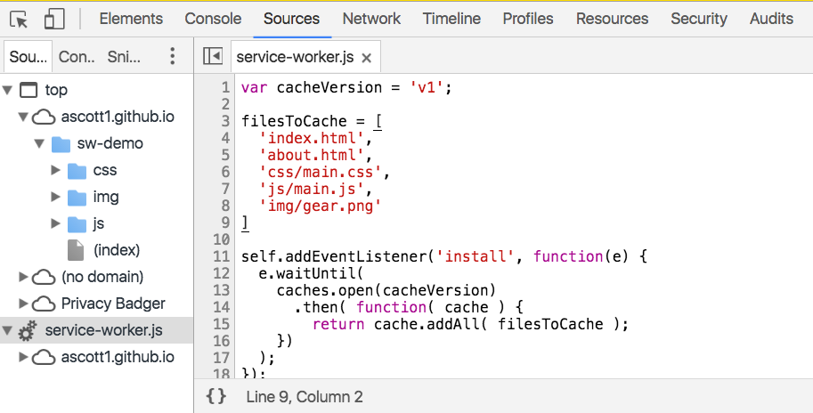
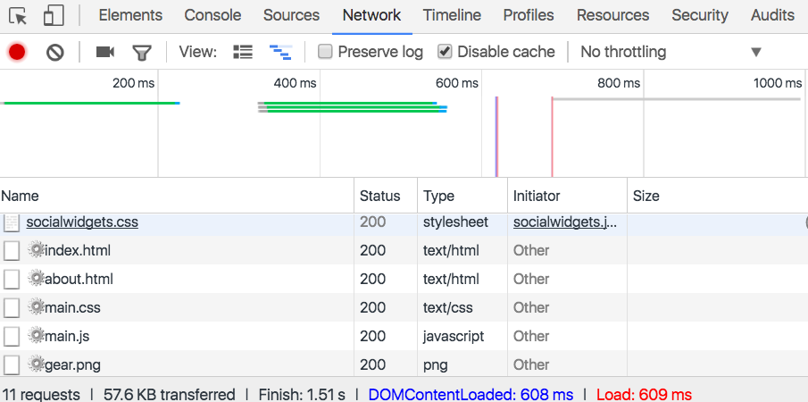
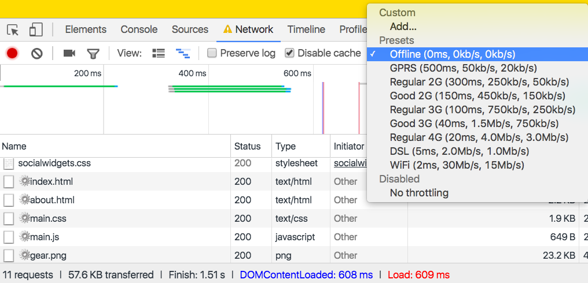

# Offline

> We live in a disconnected & battery powered world, but our technology and best practices are a leftover from the always connected & steadily powered past.

— [offlinefirst.org](http://offlinefirst.org/)

As discussed in the previous chapter, good web performance benefits all of our users, especially those on slow connections. But often users are accessing our sites in variable network conditions. A person may pick up their phone and begin browsing through our site at home over wifi, but open the browser again offline on the subway, only to be presented with dreaded offline error messages.

Even more infuriating are the times where we appear to be connected to the network, but assets are failing to load. This experience is something that developer [Jake Archibald](https://jakearchibald.com/) has termed Lie-Fi. Everything seems like it should be working, but are slow to load as they feebly connect to our struggling signal. 

There are a number of potential reasons, besides a poor signal that a user may experience poor network conditions, such as:

- An overloaded cellular network
- Problems with the website’s server
- A misconfigured proxy
- Being nearby a previously accessed wifi network

Creating offline experiences for our users can simply provide us the ability to brand and give better error messaging to our users on a poor connection, provide limited functionality of our sites to offline users, or even create seamless offline experiences. As a bonus, offline web applications work blazingly fast, providing a benefit to users on all types of connections. In this chapter, we’ll look at two technologies that make offline experiences possible, Service Workers and in-browser databases.


## Service Workers

[Service Workers](https://www.w3.org/TR/service-workers/) are a script that runs separately from the page, which provide us with a way to make our sites to work offline, run faster, and add capabilities for background features. With the limits of connectivity, Service Workers provide us with a means to build offline-first capable applications, which will load content for our users, after an initial site visit, regardless of network conditions. Best of all, Service Workers are truly a progressive enhancement, layering on an additional feature to supporting browsers without changing the functionality of our site for users of non-supporting browsers.

Service Workers present us with many possibilities for how we handle user connectivity. For our purposes, let’s build a simple static site example that will cache all of our site’s static assets. If you are interested in following along, you can download a Service Worker free version of this example at [https://github.com/ascott1/sw-demo/archive/no-sw.zip](https://github.com/ascott1/sw-demo/archive/no-sw.zip).

<aside>
NOTE: 
There are a potential gotchas when implementing Service Workers:

1. Sites using a Service Worker must be served over https.
2. Service Workers do not work when a user is in private browsing mode.
3. Browser support is limited, but growing: At the time of writing, supported in Chrome, Firefox, and Opera, with planned implementation in Microsoft Edge and is under consideration for Safari [^1].
4. Since Service Workers run as in a separate thread in the browser, they do not have access to the DOM.
5. Service workers are scoped, meaning that they should be placed in the root of your application.

</aside>


The first step of working with a Service Worker is registering the script that will contain our Service Worker code. Let’s begin by adding that code to our HTML pages. At the bottom of the page, just before the closing `</body>` tag let’s add the script registration:

```
<!-- initiate the service worker -->
<script>
  if( 'serviceWorker' in navigator ) {
      navigator.serviceWorker
        .register( '/service-worker.js' )
        .catch(function( err ) {
          console.log( 
          'ServiceWorker registration failed: ', err 
          );
         });
   }
</script>
```

This script checks for service worker support and if the support is available points the browser to a service worker script (in our case `service-worker.js`). For debugging purposes we’re also catching errors and logging the error to the console.

Now that we have our script registration, let’s write our service worker. To begin create a `service-worker.js` file and place it in the root of the directory. Let’s start by specifying a version of our cache and listing the files we would like the service worker to cache. In our case we’ll cache our two HTML pages, a CSS file, a JS file, and an image.

```
var cacheVersion = 'v1';

filesToCache = [
  '/',
  '/index.html',
  '/about.html',
  '/css/main.css',
  '/js/main.js',
  '/img/gear.png'
]
```

If we make changes to our site, we would need to increment the cacheVersion value or risk users being served content from our cache.

Now we can set up two event listeners in our service worker, `install` and `fetch`. The `install` service worker provides the browser with instructions for installing our cached files, while `fetch` provides the browser with guidelines for handling fetch events by providing the browser with either our cached files or those received over the network.

```js
self.addEventListener('install', function (e) {
  e.waitUntil(caches.open(cacheVersion)
    .then(function (cache) {
      return cache.addAll(filesToCache)
        .then(function () {
          return self.skipWaiting();
        });
    }));
});

self.addEventListener('fetch', function (event) {
  event.respondWith(caches.match(event.request)
    .then(function (res) {
      return res || fetch(event.request);
  }));
});
```

You can the full version of our service-worker.js file at [https://github.com/ascott1/sw-demo/blob/gh-pages/service-worker.js](https://github.com/ascott1/sw-demo/blob/gh-pages/service-worker.js).

With these additions our simple static site is ready to work offline. To see it in action, let’s visit the demo page at [https://ascott1.github.io/sw-demo/](https://ascott1.github.io/sw-demo/).

In Chrome Developer Tools we can see that the Service Worker has been downloaded in the Sources panel.



In the Network panel the files that have been cached through the Service Worker are listed with a gear icon next to their filenames.



Now to test the offline capability of our site by changing the “Throttling” setting in the Network panel to “Offline” and reloading our page.



Despite being offline, our site and site assets continue to load and are navigable. This example is simple, loading a two page static site and with minimal error handling. To dive into how these concepts can be applied to production ready sites and applications, see the further reading section at the end of this chapter.

[^1]: https://jakearchibald.github.io/isserviceworkerready/

### Service Worker Tools

Managing our site’s Service Worker by hand can become unwieldy, thankfully the Google Chrome team has developed two incredibly useful tools for incorporating Service Workers into our development process. 

[sw-precache](https://github.com/GoogleChrome/sw-precache) is a Node.js module that generates service workers for precaching static resources, similar to our demo. sw-precache even handles the versioning and cache busting, making it much simpler than managing a service worker by hand. Helpfully, they also provide sample [Gulp](https://github.com/GoogleChrome/sw-precache/blob/master/demo/gulpfile.js) and [Grunt](https://github.com/GoogleChrome/sw-precache/blob/master/demo/Gruntfile.js) configurations. The module can also be used standalone from the command line or as part of a [package.json script](https://github.com/ascott1/ethicalweb.org/blob/master/package.json#L28). 

Here is a sample Gulp configuration for sw-precache that would cache all of our HTML, CSS, JS, and image files.

```
var swPrecache = require('sw-precache');

gulp.task('generate-service-worker', function(callback) {
  swPrecache.write('service-worker.js'), {
    staticFileGlobs: [
      rootDir + '/**/*.{
        html,
        css
        js,
        png,
        jpg,
        gif,
        svg
      }'
     ]
  }, callback);
});
```

[sw-toolbox](https://github.com/GoogleChrome/sw-toolbox) is a script that can be imported into a Service Working, providing an API for helpers such as a variety of caching strategies, Express-style and Regex routing, and cache age. The full API is available at [https://googlechrome.github.io/sw-toolbox/docs/master/tutorial-api](https://googlechrome.github.io/sw-toolbox/docs/master/tutorial-api). 

## In-Browser Databases

In-browser databases provide us a way to store persistent data directly in a user’s browser. This allows us to store user data locally or to sync data from a database for offline use. This is similar to how a native mobile application might handle user data, storing user files locally and periodically syncing with a server when a device is connected to the network. 

The standard for in browser storage is [IndexedDB](https://www.w3.org/TR/IndexedDB/), a hierarchical key/value database for in browser use with good browser support[^1]. Let’s look at how we might add an IndexedDB database to a site.

The first step when working with IndexedDB is to create and open a database.

```
var indexedDB = window.indexedDB;
var open = indexedDB.open('ShuttleDatabase', 1);
```

Next we will create the schema for our database, by adding the object stores we will need for our database as part of the `on upgradeneeded`method:

```
open.onupgradeneeded = function() {
  var db = open.result;
  var store = db.createObjectStore('Missions', {keyPath: "id"});
};
```

Then we can create event handlers for both successful creation or to handle errors.

```
open.onerror = function(event) {
  // error handler
  console.log(
    'Houston, we have problem: ' + event.target.errorCode
  );
};

open.onsuccess = function(event) {
  // success
  console.log('We have liftoff!');
};
```

Now let’s start a new database transaction and add some data to our database.

```
open.onsuccess = function() {
  var db = open.result;
  var transaction = db.transaction('Missions', 'readwrite');
  var objectStore = transaction.objectStore('Missions');

  // our data
  objectStore.put({
    id: "STS-41-D",
    shuttle: "Discovery",
    crew: 6,
    launchDate: new Date(1984, 07, 30, 12, 41, 50) // 30 August 1984 12:41:50
  });
  objectStore.put({
    id: "STS-51-J",
    shuttle: "Atlantis",
    crew: 5,
    launchDate: new Date(1985, 09, 03, 15, 15, 30) // 3 October 1985 15:15:30
  });
}
```

We can then query that data inside of our `onsuccess` handler.

```
var getDiscovery = objectStore.get('STS-41-D');
var getAtlantis = objectStore.get('STS-51-J');

getColumbia.onsuccess = function() {
  console.log(getDiscovery.result.shuttle);
};

getChallenger.onsuccess = function() {
  console.log(getAtlantis.result.launchDate);
};
```

Lastly we need to close the database transaction once we are done.

```
transaction.oncomplete = function() {
  db.close();
};
```

Putting it all together, it would look like this:

```javascript
var indexedDB = window.indexedDB;

// open or create the database
var open = indexedDB.open('ShuttlesDatabase', 1);

// open or create the schema
open.onupgradeneeded = function() {
  var db = open.result;
  var store = db.createObjectStore('Missions', {keyPath: "id"});
};

// handle errors
open.onerror = function(event) {
  console.log(
    'Houston, we have problem: ' + event.target.errorCode
  );
};

open.onsuccess = function() {
  // begin the transaction
  var db = open.result;
  var transaction = db.transaction('Missions', 'readwrite');
  var objectStore = transaction.objectStore('Missions');

  // add data
  objectStore.put({
    id: "STS-41-D",
    shuttle: "Discovery",
    crew: 6,
    launchDate: new Date(1984, 07, 30, 12, 41, 50) // 30 August 1984 12:41:50
  });
  objectStore.put({
    id: "STS-51-J",
    shuttle: "Atlantis",
    crew: 5,
    launchDate: new Date(1985, 09, 03, 15, 15, 30) // 3 October 1985 15:15:30
  });

  // query our data
  var getDiscovery = objectStore.get('STS-41-D');
  var getAtlantis = objectStore.get('STS-51-J');

  getColumbia.onsuccess = function() {
    console.log(getDiscovery.result.shuttle);
  };

  getChallenger.onsuccess = function() {
    console.log(getAtlantis.result.launchDate);
  };

  // close the db when the transaction is done
  transaction.oncomplete = function() {
    db.close();
  };
}
```

IndexedDB is an exciting technology, but the API leaves a little to be desired. [localForage](https://github.com/mozilla/localForage) is a library from Mozilla that creates an asynchronous API (using either Promises or Node-style callbacks) for in-browser databases. It also expands the browser capability of offline storage by supporting IndexedDB and WebSQL with a localStorage fallback. Through these additions, localForage simplifies the code needed to create, add data to, and retrieve data from our database. Here’s a version of the above code that would add our data to localForage and log the results.

```
// our data
var shuttles = [
  {
    id: "STS-41-D",
    shuttle: "Discovery",
    crew: 6,
    launchDate: new Date(1984, 07, 30, 12, 41, 50) // 30 August 1984 12:41:50
  },
  {
    id: "STS-51-J",
    shuttle: "Atlantis",
    crew: 5,
    launchDate: new Date(1985, 09, 03, 15, 15, 30) // 3 October 1985 15:15:30
  }
];

// store the data
localforage.setItem('shuttles', shuttles);

// retrieve the data
localforage.getItem('shuttles').then(function(value) {
    console.log(value);
}).catch(function(err) {
    console.log('Houston, we have a problem');
});

```


Though our in-browser database may make it simpler for users to access our applications in a disconnected state, it is likely that we will not want the data to live only in the browser. To handle this, we will most likely want to sync user data when the user is online. We can do this with IndexedDB and our database. Another attractive option is [PouchDB](https://pouchdb.com/), which is a JavaScript implementation of [Apache CouchDB](https://couchdb.apache.org/). PouchDB provides a local database API and makes it easy to sync the local database with any remote instance of CouchDB.

Using an in-browser database may not be ideal for all applications, but it expands the suite of solutions for building applications that are responsive in a wide variety of network conditions. By considering these solutions, we give our users the opportunity to connect with our application’s data offline.

[^1]: http://caniuse.com/#feat=indexeddb

## Additional libraries and tools

The libraries and tools covered in this chapter are just a small fraction of those available to us for developing offline capable applications. Below is a list of a few other useful tools that are worth your investigation.

- [Hoodie](http://hood.ie/)
- [remoteStorage](https://remotestorage.io/)
- [Kinto](http://www.kinto-storage.org/)
- [IndexedDB Promised](https://github.com/jakearchibald/indexeddb-promised)
- [Webpack offline-plugin](https://github.com/NekR/offline-plugin)
- [UpUp](https://www.talater.com/upup/)
- [Offline.js](http://github.hubspot.com/offline/docs/welcome/)
- [Hyperboot](http://hyperboot.org/)


## Conclusion

The site [Offline States](http://offlinestat.es/) collects screenshots of mobile applications in a disconnected state, providing good inspiration for how to handle (or not handle) disconnected user states.

## Further Reading

- [Offline First](http://offlinefirst.org/)
- [The Offline Cookbook](https://jakearchibald.com/2014/offline-cookbook/)
- [Designing Offline-First Web Apps](http://alistapart.com/article/offline-first)
- [Offline-First Awesome List](https://github.com/pazguille/offline-first)
- [Service Worker Cookbook](https://serviceworke.rs/)
- [Service Workers Explained](https://github.com/slightlyoff/ServiceWorker/blob/master/explainer.md)
- [Your first offline web app](https://developers.google.com/web/fundamentals/getting-started/your-first-offline-web-app)
- [Using IndexedDB](https://developer.mozilla.org/en-US/docs/Web/API/IndexedDB_API/Using_IndexedDB)
- [MDN: Working Offline](https://developer.mozilla.org/en-US/Apps/Fundamentals/Offline)
- [Service Workers in Production](https://developers.google.com/web/showcase/2015/service-workers-iowa)